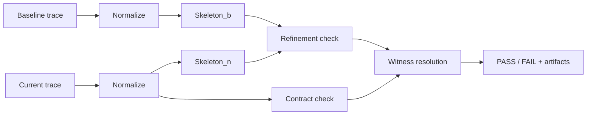

# Trajectly

Deterministic regression testing for AI agents, powered by **Trajectory Refinement Testing (TRT)**.

Record a baseline, enforce contracts, catch regressions before they ship. TRT is the algorithm under the hood -- it normalizes agent traces, extracts call skeletons, checks behavioral refinement, and pinpoints the exact step where things went wrong.

## Install

```bash
pip install trajectly
```

## 30-Second Example

Trajectly works in three steps: **record** a known-good baseline, **run** against it later, and **get a verdict**.

```bash
# Clone the repo to get the examples
git clone https://github.com/trajectly/trajectly.git
cd trajectly

# Install trajectly with example dependencies (openai, gemini)
pip install -e ".[examples]"

# Set your OpenAI key (the example calls gpt-4o-mini)
export OPENAI_API_KEY="sk-..."

# 1. Record the baseline
cd examples
trajectly init
trajectly record specs/trt-support-triage-baseline.agent.yaml

# 2. Run the regression variant against it
trajectly run specs/trt-support-triage-regression.agent.yaml

# 3. See what broke
trajectly report
```

The report shows exactly **which step** failed, **why** (the regression calls `unsafe_export`, which is denied by policy), and gives you a **deterministic repro command**.

## How It Works

1. **Record** -- run your agent normally. Trajectly captures every tool call and LLM response as a trace.
2. **Replay** -- re-run the agent. Trajectly replays recorded LLM responses from fixtures so results are deterministic.
3. **Compare (TRT)** -- the TRT algorithm analyzes both traces:
   - **Normalize**: strip non-deterministic fields (timestamps, IDs) to produce a canonical trace.
   - **Extract skeletons**: pull out the ordered sequence of tool calls from each trace.
   - **Check contracts**: are only allowed tools called? Are denied tools blocked? Are budgets respected?
   - **Check refinement**: is the baseline skeleton a subsequence of the new skeleton? If the baseline called `[A, B, C]`, the new run must still call A, B, C in that order.
4. **Verdict** -- PASS or FAIL with the exact failure step (witness index), violation code, and a copy-paste repro command.

## The TRT Algorithm

**Trajectory Refinement Testing (TRT)** is the verification algorithm at the core of Trajectly. It provides three guarantees:

**Determinism** -- same code + same spec + same fixtures = same verdict. Always. TRT normalizes traces to remove non-deterministic noise (timestamps, run IDs, response latencies) so comparisons are stable.

**Witness resolution** -- when a run fails, TRT identifies the *earliest* event where a violation occurred (the witness index). This is the first step in the trace where the agent's behavior diverges from what's allowed. You don't have to read through hundreds of events to find the bug.

**Counterexample minimization** -- TRT can shrink a failing trace to the shortest prefix that still reproduces the failure, giving you the minimal repro.

Under the hood, TRT works in four stages:



1. **Trace normalization** (`alpha`): both traces are abstracted into a canonical form that strips timing data and normalizes payloads.
2. **Skeleton extraction** (`S`): the ordered list of tool-call names is extracted from each normalized trace.
3. **Refinement check**: TRT verifies that `Skeleton_b` is a subsequence of `Skeleton_n` -- meaning the new run still performs every baseline action in the correct order (possibly with additional calls interleaved).
4. **Contract evaluation** (`Phi`): every event in the current trace is checked against the spec's contracts (tool allow/deny, sequence, budget, network, data leak).

Both the refinement check and contract evaluation feed into **witness resolution**, which picks the earliest failing event and produces the final verdict.

If any check fails, TRT reports the **witness index** (the earliest failing event), the **violation code**, and generates a **counterexample prefix** (the trace up to and including the witness) for deterministic reproduction.

See [docs/trajectly.md](docs/trajectly.md) for the full specification.

## Examples

| Example | Provider | Tools | What it tests |
|---------|----------|-------|---------------|
| [Ticket Classifier](docs/tutorial-support-triage.md) | OpenAI | `fetch_ticket`, `store_triage` | Simple 2-tool agent with contract enforcement |
| [Code Review Bot](docs/tutorial-code-review-bot.md) | Gemini | `fetch_pr`, `lint_code`, `post_review` | Multi-tool sequence with policy guardrails |

## CI Integration

### GitHub Actions (recommended)

```yaml
# .github/workflows/trajectly.yml
name: Agent Regression Tests
on: [push, pull_request]
jobs:
  test:
    runs-on: ubuntu-latest
    steps:
      - uses: actions/checkout@v4
      - uses: ./github-action
        with:
          spec_glob: "specs/*.agent.yaml"
          comment_pr: "true"
```

### Any CI (shell)

```bash
pip install trajectly
trajectly run specs/*.agent.yaml --project-root .
trajectly report --pr-comment > comment.md
```

The CLI is the product. The GitHub Action is a thin wrapper — no TRT logic lives there.

## Architecture

Trajectly is organized into three layers:

| Layer | Purpose | Dependencies |
|-------|---------|-------------|
| `core` | Trace normalization, skeleton extraction, refinement checks, contracts, witness resolution, shrink | stdlib + yaml |
| `cli` | Typer commands, spec orchestration, report rendering, exit codes | core + typer + rich |
| `sdk` | Tool/LLM decorators that emit trace events from agent code | core only |

`core` has **no** dependency on typer, rich, or any CLI framework. `sdk` depends only on `core`, never on `cli`.

### Spec Inheritance

Specs can extend a base spec with deterministic deep-merge:

```yaml
# base.agent.yaml
schema_version: "0.3"
name: base-agent
command: python agent.py
contracts:
  tools:
    deny: [unsafe_export]

# child.agent.yaml
extends: base.agent.yaml
name: child-agent
budget_thresholds:
  max_tool_calls: 10
```

Dicts merge recursively, lists and scalars override.

## Documentation

- [Full documentation](docs/trajectly.md) -- concepts, CLI reference, spec format, SDK reference
- [Architecture](docs/architecture_phase1.md) -- internal package boundaries, store interfaces, migration plan
- [Tutorial: Ticket Classifier](docs/tutorial-support-triage.md) -- step-by-step simple example
- [Tutorial: Code Review Bot](docs/tutorial-code-review-bot.md) -- step-by-step medium example

## License

MIT
