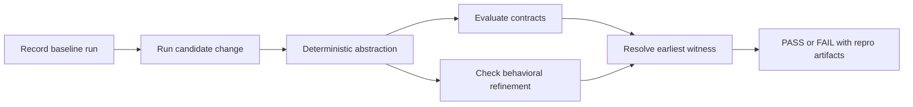

# Trajectly

Deterministic regression testing for LLM agents.

Trajectly helps teams test agent behavior like software behavior. You record a known-good baseline trajectory, run a
candidate change against the same fixtures, and get a stable `PASS` or `FAIL` with an exact witness index when behavior
regresses.

## What problem this solves

LLM agent regressions are often hard to trust and hard to reproduce:

- prompt changes silently alter tool usage
- CI signals become flaky or subjective
- debugging depends on re-running live providers

Trajectly turns these into deterministic checks with replayable artifacts.

## What you get

- deterministic verdicts (`PASS` or `FAIL`)
- earliest witness index for the failure
- canonical violation code for triage
- one-command local repro from stored fixtures

## How it works



## Install (PyPI)

```bash
python -m pip install --upgrade pip
pip install trajectly
```

## Local Development Install

```bash
python -m pip install --upgrade pip
pip install -e ".[dev]"
```

## Quick Walkthrough: Ticket Classifier (Simplest Example)

This is the fastest way to see Trajectly value end-to-end.

```bash
cd examples
trajectly init
trajectly record specs/trt-support-triage-baseline.agent.yaml
trajectly run specs/trt-support-triage-baseline.agent.yaml
trajectly run specs/trt-support-triage-regression.agent.yaml
trajectly repro
```

### What each command does

1. `trajectly init` initializes local `.trajectly` state.
2. `record ...baseline...` records the known-good trajectory and fixtures.
3. `run ...baseline...` verifies baseline behavior still passes.
4. `run ...regression...` executes an intentional regression and returns deterministic `FAIL`.
5. `repro` reproduces the same failure locally from fixtures.

### Expected result pattern

```text
# Baseline replay
trt-support-triage: PASS

# Regression replay
trt-support-triage: FAIL
witness_index: <event_index>
primary_violation: contract_tool_denied
```

The regression spec intentionally calls a denied tool (`unsafe_export`), so Trajectly reports the first violating step
and preserves a reproducible failure artifact.

## Failure Artifact Example

```json
{
  "spec_name": "trt-support-triage",
  "trt_status": "FAIL",
  "witness_index": 12,
  "primary_violation": "contract_tool_denied",
  "repro_command": "trajectly repro"
}
```

## In-Repo Examples

Example scenarios are bundled in:

- `examples/specs/`
- `examples/examples/`
- `examples/README.md`

## Documentation

Full documentation: `docs/trajectly.md`

## License

MIT
