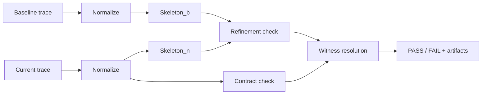

# Trajectly

Deterministic regression testing for AI agents, powered by **Trajectory Refinement Testing (TRT)**.

Record a baseline, enforce contracts, catch regressions before they ship. TRT is the algorithm under the hood -- it normalizes agent traces, extracts call skeletons, checks behavioral refinement, and pinpoints the exact step where things went wrong.

## Install

```bash
python -m pip install trajectly
```

## 30-Second Example

Pre-recorded fixtures are included in standalone demo repos, so you can try Trajectly immediately -- **no API keys needed**.

```bash
git clone https://github.com/trajectly/procurement-approval-demo.git
cd procurement-approval-demo
python3.11 -m venv .venv
source .venv/bin/activate
python -m pip install --upgrade pip
python -m pip install -r requirements.txt

# Run the regression test (replays from pre-recorded fixtures)
python -m trajectly run specs/trt-procurement-agent-regression.agent.yaml --project-root .

# See what broke
python -m trajectly report

# Reproduce the exact failure
python -m trajectly repro

# Minimize to shortest failing trace
python -m trajectly shrink
```

The report shows exactly **which step** failed, **why** (the regression calls `unsafe_direct_award`, which is denied by policy), and gives you a **deterministic repro command**.

### Recording your own baselines

When testing your own agents, you record a baseline first (this requires a live LLM provider):

```bash
export OPENAI_API_KEY="sk-..."   # only needed for recording
python -m trajectly init
python -m trajectly record my-agent.agent.yaml
```

After recording, all future `python -m trajectly run` calls replay from the captured fixtures -- fully offline and deterministic.

## How It Works

1. **Record** -- run your agent normally. Trajectly captures every tool call and LLM response as a trace.
2. **Replay** -- re-run the agent. Trajectly replays recorded LLM responses from fixtures so results are deterministic.
3. **Compare (TRT)** -- the TRT algorithm analyzes both traces:
   - **Normalize**: strip non-deterministic fields (timestamps, IDs) to produce a canonical trace.
   - **Extract skeletons**: pull out the ordered sequence of tool calls from each trace.
   - **Check contracts**: are only allowed tools called? Are denied tools blocked? Are budgets respected?
   - **Check refinement**: is the baseline skeleton a subsequence of the new skeleton? If the baseline called `[A, B, C]`, the new run must still call A, B, C in that order.
4. **Verdict** -- PASS or FAIL with the exact failure step (witness index), violation code, and a copy-paste repro command.

## The TRT Algorithm

**Trajectory Refinement Testing (TRT)** is the verification algorithm at the core of Trajectly. It provides three guarantees:

**Determinism** -- same code + same spec + same fixtures = same verdict. Always. TRT normalizes traces to remove non-deterministic noise (timestamps, run IDs, response latencies) so comparisons are stable.

**Witness resolution** -- when a run fails, TRT identifies the *earliest* event where a violation occurred (the witness index). This is the first step in the trace where the agent's behavior diverges from what's allowed. You don't have to read through hundreds of events to find the bug.

**Counterexample minimization** -- TRT can shrink a failing trace to the shortest prefix that still reproduces the failure, giving you the minimal repro.

Under the hood, TRT works in four stages:



1. **Trace normalization** (`alpha`): both traces are abstracted into a canonical form that strips timing data and normalizes payloads.
2. **Skeleton extraction** (`S`): the ordered list of tool-call names is extracted from each normalized trace.
3. **Refinement check**: TRT verifies that `Skeleton_b` is a subsequence of `Skeleton_n` -- meaning the new run still performs every baseline action in the correct order (possibly with additional calls interleaved).
4. **Contract evaluation** (`Phi`): every event in the current trace is checked against the spec's contracts (tool allow/deny, sequence, budget, network, data leak).

Both the refinement check and contract evaluation feed into **witness resolution**, which picks the earliest failing event and produces the final verdict.

If any check fails, TRT reports the **witness index** (the earliest failing event), the **violation code**, and generates a **counterexample prefix** (the trace up to and including the witness) for deterministic reproduction.

See [docs/trajectly.md](docs/trajectly.md) for the full specification.

## Examples

| Example | Provider | Tools | What it tests |
|---------|----------|-------|---------------|
| [Support Escalation Demo (standalone repo)](https://github.com/trajectly/support-escalation-demo) | OpenAI + deterministic replay | `fetch_ticket`, `check_entitlements`, `escalate_to_human` | Real end-to-end PR workflow with dashboard, CI gate, repro, and shrink |
| [Procurement Approval Demo (standalone repo)](https://github.com/trajectly/procurement-approval-demo) | OpenAI + deterministic replay | `fetch_requisition`, `fetch_vendor_quotes`, `route_for_approval`, `create_purchase_order` | Procurement governance regression loop with denied direct-award path |

Each standalone demo includes full README + tutorial walkthroughs (record, run, repro, shrink, fail/fix loop).

## CI Integration

### Any CI (recommended)

Trajectly works in any CI system with a single install:

```bash
python -m pip install trajectly
python -m trajectly run specs/*.agent.yaml --project-root .
python -m trajectly report --pr-comment > comment.md
```

### GitHub Actions

A thin composite action wrapper is included (no TRT logic lives there):

```yaml
# .github/workflows/trajectly.yml
name: Agent Regression Tests
on: [push, pull_request]
jobs:
  test:
    runs-on: ubuntu-latest
    steps:
      - uses: actions/checkout@v4
      - uses: ./github-action          # from within the Trajectly repo
        with:
          spec_glob: "specs/*.agent.yaml"
          comment_pr: "true"
```

For external repos, use the shell approach above or reference the action directly:

```yaml
      - uses: trajectly/trajectly/github-action@main
```

Caching `.trajectly/` across runs speeds up CI:

```yaml
      - uses: actions/cache@v4
        with:
          path: .trajectly
          key: trajectly-${{ hashFiles('specs/**') }}
          restore-keys: trajectly-
```

See [support-escalation-demo/.github/workflows/trajectly.yml](https://github.com/trajectly/support-escalation-demo/blob/main/.github/workflows/trajectly.yml), [procurement-approval-demo/.github/workflows/trajectly.yml](https://github.com/trajectly/procurement-approval-demo/blob/main/.github/workflows/trajectly.yml), and [docs/ci_github_actions.md](docs/ci_github_actions.md) for full reference.

## Architecture

Trajectly is organized into three layers:

| Layer | Purpose | Dependencies |
|-------|---------|-------------|
| `core` | Trace normalization, skeleton extraction, refinement checks, contracts, witness resolution, shrink | stdlib + yaml |
| `cli` | Typer commands, spec orchestration, report rendering, exit codes | core + typer + rich |
| `sdk` | Tool/LLM decorators that emit trace events from agent code | core only |

`core` has **no** dependency on typer, rich, or any CLI framework. `sdk` depends only on `core`, never on `cli`.

### Spec Inheritance

Specs can extend a base spec with deterministic deep-merge:

```yaml
# base.agent.yaml
schema_version: "0.4"
name: base-agent
command: python agent.py
contracts:
  tools:
    deny: [unsafe_export]

# child.agent.yaml
extends: base.agent.yaml
name: child-agent
budget_thresholds:
  max_tool_calls: 10
```

Dicts merge recursively, lists and scalars override.

## Dashboard (optional)

Trajectly includes an optional local dashboard for visual trace inspection. It reads the same `.trajectly/reports/` data the CLI generates -- no cloud services required.

```bash
git clone https://github.com/trajectly/trajectly-dashboard-local.git
cd trajectly-dashboard-local
npm install
npm run dev
```

Use the **CLI** for running tests, CI integration, and quick pass/fail checks. Use the **dashboard** when you want to visually inspect agent flow graphs, trace timelines, or compare baseline vs current metrics.

The production dashboard is live at [trajectly.dev](https://trajectly.dev).

## Documentation

- [Full documentation](docs/trajectly.md) -- concepts, CLI reference, spec format, SDK reference
- [Architecture](docs/architecture_phase1.md) -- internal package boundaries, store interfaces
- [CI: GitHub Actions](docs/ci_github_actions.md) -- workflow examples, inputs, artifacts
- [Support Escalation Demo repository](https://github.com/trajectly/support-escalation-demo) -- full real-world CI/PR regression walkthrough
- [Procurement Approval Demo repository](https://github.com/trajectly/procurement-approval-demo) -- procurement governance regression walkthrough

## Contributing

```bash
git clone https://github.com/trajectly/trajectly.git
cd trajectly
python -m pip install -e ".[dev]"
```

Run the test suite:

```bash
pytest tests/
ruff check .
mypy src/trajectly/__main__.py src/sitecustomize.py --ignore-missing-imports
```

Tests do not require API keys (agents use mock LLM fixtures during replay).

## License

Apache 2.0 -- see [LICENSE](LICENSE).
