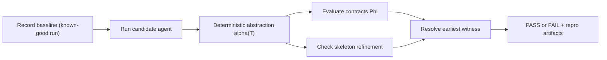

# Trajectly

Deterministic regression testing for LLM agents with trace-based contracts and behavioral refinement.

Trajectly helps you treat agent behavior like testable software behavior. You record a known-good baseline trace, run
the same spec on new code, and get a deterministic `PASS` or `FAIL` with a concrete witness index when behavior
regresses. When it fails, Trajectly gives you a replayable counterexample so debugging is fast and reproducible.

## Why teams use Trajectly

- **Deterministic verdicts:** same trace + same spec + same fixtures => same result.
- **Witness-first debugging:** failure points to the earliest violating event.
- **One-command offline repro:** no live API calls required to reproduce a failure.
- **Framework-agnostic workflow:** one testing loop across OpenAI, Gemini, LangGraph, and LlamaIndex.

## How it works in 60 seconds



## Quick Start: Ticket Classifier (Example A)

This is the simplest real scenario and the fastest way to understand what Trajectly gives you.

```bash
cd ../trajectly-examples
trajectly init
trajectly record specs/trt-support-triage-baseline.agent.yaml
trajectly run specs/trt-support-triage-baseline.agent.yaml
trajectly run specs/trt-support-triage-regression.agent.yaml
TRAJECTLY_CI=1 trajectly repro --latest
```

Expected behavior:

```text
# 1) Record baseline
Recorded baseline trace and fixtures for trt-support-triage.

# 2) Baseline replay check
trt-support-triage: PASS
exit code: 0

# 3) Regression replay check
trt-support-triage: FAIL
witness_index: <event_index>
primary_violation: contract_tool_denied
exit code: 1

# 4) Offline repro
Replayed latest failure from fixtures successfully.
```

The regression spec intentionally calls a denied tool (`unsafe_export`), so Trajectly fails deterministically and points
to the exact violating event.

## What you get on failure

Trajectly writes machine-readable and human-readable artifacts:

- report summary (`latest.json`, `latest.md`)
- per-spec diff report
- counterexample prefix trace
- deterministic repro command

Example report payload (simplified):

```json
{
  "spec_name": "trt-support-triage",
  "trt_status": "FAIL",
  "witness_index": 12,
  "primary_violation": "contract_tool_denied",
  "repro_command": "TRAJECTLY_CI=1 trajectly repro --latest"
}
```

## Feature Highlights

| Capability | What it checks | Why it matters |
| --- | --- | --- |
| Contracts (`Phi`) | Allowed/denied tools, sequence, data-leak/network rules | Enforces explicit safety and protocol constraints |
| Skeleton refinement | `S(T_b) <= S(T_n)` over tool calls | Detects dropped or reordered required behavior |
| Witness resolution | Earliest violation index | Makes failures explainable and actionable |
| Offline repro | Replay from recorded fixtures | Removes flaky "cannot reproduce" debugging loops |
| Counterexample shrink | Smaller failing trace | Speeds up root-cause analysis |

## Supported Frameworks and Providers

- [OpenAI](https://platform.openai.com/)
- [Gemini](https://ai.google.dev/)
- [LangGraph](https://www.langchain.com/langgraph)
- [LlamaIndex](https://www.llamaindex.ai/)

See adapter-specific examples in `../trajectly-examples` and in
[`docs/platform_adapters.md`](docs/platform_adapters.md).

## Documentation

### Getting Started

- [`docs/start_here.md`](docs/start_here.md)
- [`docs/trt/quickstart.md`](docs/trt/quickstart.md)

### Understand TRT Theory and Guarantees

- [`docs/trt/what-is-trt.md`](docs/trt/what-is-trt.md)
- [`docs/trt_theory.md`](docs/trt_theory.md)
- [`docs/trt/guarantees.md`](docs/trt/guarantees.md)
- [`docs/how_trt_provides_value.md`](docs/how_trt_provides_value.md)

### References

- [`docs/cli_reference.md`](docs/cli_reference.md)
- [`docs/agent_spec_reference.md`](docs/agent_spec_reference.md)
- [`docs/trace_schema_reference.md`](docs/trace_schema_reference.md)
- [`docs/trt/contracts-reference.md`](docs/trt/contracts-reference.md)
- [`docs/trt/abstraction-reference.md`](docs/trt/abstraction-reference.md)
- [`docs/trt/troubleshooting.md`](docs/trt/troubleshooting.md)

## Install

### Recommended (`uv`)

```bash
uv venv
source .venv/bin/activate
uv sync --extra dev
```

### Pip (Supported)

```bash
python -m venv .venv
source .venv/bin/activate
pip install -e .[dev]
```

## Contributing

See [`CONTRIBUTING.md`](CONTRIBUTING.md).

## License

MIT
