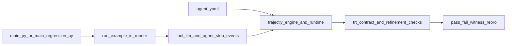

# Examples Developer Guide: Code, Specs, and TRT

This guide explains how the 8 packaged examples are built, how their `.agent.yaml` specs drive TRT, and how to extend them safely.

Use it with:

- `examples/README.md` for command-level onboarding
- `docs/trajectly.md` for full TRT theory and full schema reference
- `docs/tutorial-*.md` files for scenario-by-scenario walkthroughs

## 1) Fast Mental Model



The examples are intentionally simple:

- baseline entrypoint -> expected `PASS`
- regression entrypoint -> expected `FAIL` (usually via `unsafe_export`)

## 2) Directory Anatomy

From `trajectly/examples`:

```text
examples/
  examples/
    support_triage/
      main.py
      main_regression.py
    ...
    real_llm_ci/
      runner.py
  specs/
    trt-support-triage-baseline.agent.yaml
    trt-support-triage-regression.agent.yaml
    ...
  README.md
```

Key relationship:

- `examples/examples/<scenario>/main.py` and `main_regression.py` choose scenario/provider/mode.
- `examples/examples/real_llm_ci/runner.py` contains tool definitions + scenario logic.
- `examples/specs/*.agent.yaml` tells Trajectly what to run and what policy to enforce.

## 3) Entrypoint Pattern (Baseline vs Regression)

Each scenario has two tiny entrypoints. Example pattern:

```python
from examples.real_llm_ci.runner import run_example

def main() -> None:
    run_example(
        scenario="web_search_agent",
        provider="openai",
        mode="baseline",  # regression entrypoint uses mode="regression"
        model="gpt-4o-mini",
    )
```

Most regression behavior is selected by the `mode` switch, not by duplicating full logic in the entrypoint.

## 4) What `runner.py` Actually Does

`examples/examples/real_llm_ci/runner.py` is the shared implementation for all examples.

It provides:

- provider responders (`openai`, `gemini`, `langgraph`, `llamaindex`)
- all example tools via `@tool(...)`
- scenario functions (for example `_web_search_agent`, `_rag_pipeline`)
- `run_example(...)` orchestration with `agent_step("start")` and `agent_step("done")`

Execution path inside `run_example(...)`:

1. validate `mode` and `scenario`
2. pick provider handler
3. emit start step
4. run scenario function
5. emit done step with output payload

Regression behavior is usually in scenario functions like:

- baseline branch -> approved terminal tool (for example `format_answer`, `notify`, `store_triage`)
- regression branch -> denied tool (`unsafe_export`)

## 5) SDK Primitives Used by Examples

Defined in `src/trajectly/sdk/__init__.py`:

- `@tool(name)` wraps a callable so runtime records `tool_called` and `tool_returned`
- `invoke_llm_call(provider, model, fn, ...)` wraps provider/model invocations for trace consistency and replay matching
- `agent_step(name, details)` emits logical milestones for easier debugging and report reading

Why this matters:

- Trajectly checks behavior using emitted events, not only final text output.
- Contract and refinement checks depend on deterministic event streams.

## 6) `.agent.yaml` Spec to Runtime Mapping

Typical example spec:

```yaml
schema_version: "0.3"
name: "trt-search-buy"
command: "python -m examples.search_buy.main"
workdir: ..
fixture_policy: by_hash
strict: true
contracts:
  tools:
    allow: [search_web, extract_content, summarize]
    deny: [unsafe_export]
```

How fields are used:

- `schema_version`: parsed by `src/trajectly/specs/v03.py`
- `name`: report identity and artifact slug source
- `command`: subprocess command executed by runtime
- `workdir`: working directory resolved relative to spec file
- `fixture_policy`: replay fixture matching strategy (`by_hash` or `by_index`)
- `strict`: strict replay behavior toggle
- `contracts.tools.allow` / `deny`: tool policy checked during TRT

Where it flows in code:

- parse/load: `src/trajectly/specs/v03.py` and `src/trajectly/specs/__init__.py`
- execution: `src/trajectly/runtime.py` (`execute_spec`)
- orchestration and TRT verdict: `src/trajectly/engine.py`

## 7) Baseline and Regression Lifecycle

From `examples/`:

```bash
trajectly init
trajectly record specs/trt-<example>-baseline.agent.yaml
trajectly run specs/trt-<example>-baseline.agent.yaml
trajectly run specs/trt-<example>-regression.agent.yaml
trajectly repro
```

Expected outcomes:

- baseline run -> `PASS`
- regression run -> `FAIL`
- first failure is anchored by `witness_index` and `primary_violation`

## 8) How to Add a New Example Pair

1. Add or reuse tools/scenario logic in `examples/examples/real_llm_ci/runner.py`.
2. Add entrypoints:
   - `examples/examples/<new_example>/main.py` with `mode="baseline"`
   - `examples/examples/<new_example>/main_regression.py` with `mode="regression"`
3. Add specs:
   - `examples/specs/trt-<new-example>-baseline.agent.yaml`
   - `examples/specs/trt-<new-example>-regression.agent.yaml`
4. Ensure tool names in spec exactly match `@tool("name")` names.
5. Record and run:
   - baseline should pass
   - regression should fail with a clear denied/drift signal
6. Add a tutorial doc in `docs/tutorial-<new-example>.md`.

## 9) Common Developer Pitfalls

- Spec `command` points to wrong module path.
- Spec `workdir` is wrong, so relative imports fail.
- Tool names in `allow` list do not match `@tool(...)` names exactly.
- Regression path does not actually violate policy, so expected `FAIL` does not happen.
- Baseline changed but was not re-recorded before replay.

## 10) Why This Developer Pattern Is Valuable

- Minimal entrypoints keep scenario intent obvious.
- Shared runner centralizes behavior for easier review and extension.
- Specs provide auditable policy boundaries in plain YAML.
- TRT outputs deterministic PASS/FAIL artifacts that are easy to triage and share.
