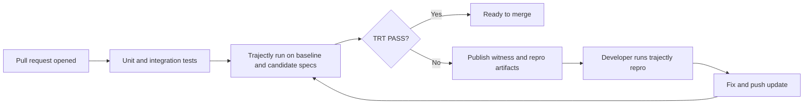

# How TRT Provides Value

Trajectory Refinement Testing (TRT) makes agent changes testable in CI with deterministic verdicts, witness-first
failures, and one-command offline repro.

## Value in one sentence

**Same code + same spec + same fixtures => same verdict.**

That one property removes most of the ambiguity teams face when shipping LLM agents.

---

## Before Trajectly vs After Trajectly

| Workflow step | Without TRT | With TRT |
| --- | --- | --- |
| Regression detection | Mostly heuristic, often prompt/output diffing | Deterministic contract and refinement checks |
| Failure location | Manual trace reading | Earliest `witness_index` from checker |
| Reproducibility | "Works on my machine" loops | `trajectly repro` |
| CI signal quality | Flaky and hard to trust | Stable `PASS`/`FAIL` with canonical violation code |
| Team handoff | Hard to share exact failure state | Counterexample artifacts are shareable and replayable |

---

## Where TRT fits in CI

This is where TRT adds leverage: it catches behavioral regressions that unit tests and type checks do not encode.

---

## Code Review Bot CI Scenario (Example C)

This is a medium-complexity scenario that demonstrates real product value.

### Baseline behavior (expected PASS)

Tool flow:

1. `fetch_pr`
2. `lint_code`
3. `post_review`

Contract policy:

- allow: `fetch_pr`, `lint_code`, `post_review`
- deny: `unsafe_export`

### Regression behavior (expected FAIL)

A code change introduces:

- `unsafe_export` instead of `post_review`

TRT result:

- `trt_status: FAIL`
- `primary_violation: contract_tool_denied`
- witness points to the violating event

### Why this matters in production

- CI catches policy violations before merge
- witness points directly to the problematic event
- repro command lets any engineer replay offline from fixtures

No one needs to re-run live provider calls to understand the failure.

---

## What Trajectly gives your team on every failure

- deterministic verdict (`PASS`/`FAIL`)
- deterministic witness index
- canonical primary violation code
- machine-readable and human-readable reports
- replayable counterexample artifacts

This gives product, infra, and application engineers a shared debugging interface.

---

## Cost of not using TRT

Without deterministic trace checks, teams usually pay in one or more of these ways:

1. **Silent regressions:** an agent appears "mostly fine" while violating safety/policy edges.
2. **Untraceable failures:** no canonical witness means slow, subjective debugging.
3. **Non-reproducible incidents:** production issue cannot be replayed exactly.
4. **Merge friction:** reviewers cannot distinguish intentional behavior changes from accidental drift.

TRT turns these into explicit, testable states in CI.

---

## Practical adoption path

1. Start with one simple spec (Ticket Classifier, Example A).
2. Add one medium spec (Code Review Bot, Example C).
3. Gate PRs on `trajectly run`.
4. Use `repro` for every failure before triage meetings.
5. Expand contracts and refinement rules as your product surface grows.

---

## Related docs

- Formal model and walkthrough: [`trt_theory.md`](trt_theory.md)
- Guarantees: [`trt/guarantees.md`](trt/guarantees.md)
- CLI reference: [`cli_reference.md`](cli_reference.md)
- Adapter coverage: [`platform_adapters.md`](platform_adapters.md)
