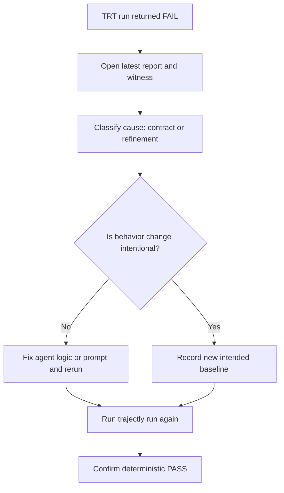

# Start Here: Trajectly in 10 Minutes

This page is the shortest practical path to understand Trajectly and validate the core value on a real example.

## What you'll learn

By the end of this quickstart, you will know how to:

- record a known-good baseline
- run TRT checks on baseline and regression specs
- read witness-driven failure output
- replay the exact failure offline

---

## Prerequisites

- `trajectly` installed and available in your shell
- access to `trajectly-examples`
- provider API key for the selected example (`OPENAI_API_KEY` for Ticket Classifier)

---

## Step 1) Initialize Trajectly state

```bash
cd ../trajectly-examples
trajectly init
```

Expected output (representative):

```text
Initialized .trajectly directories
Ready to record baselines and fixtures
```

---

## Step 2) Record a known-good baseline (Example A: Ticket Classifier)

```bash
trajectly record specs/trt-support-triage-baseline.agent.yaml
```

Expected output (representative):

```text
Running spec: trt-support-triage
Mode: record
Recorded baseline trace and fixtures
exit code: 0
```

What this does:

- runs the baseline command
- stores baseline trace events
- stores fixtures used later for deterministic replay

---

## Step 3) Verify baseline still passes

```bash
trajectly run specs/trt-support-triage-baseline.agent.yaml
```

Expected output (representative):

```text
Running spec: trt-support-triage
TRT status: PASS
exit code: 0
```

Why this matters:

- confirms replay path is healthy
- establishes a known-good CI check

---

## Step 4) Run the intentional regression

```bash
trajectly run specs/trt-support-triage-regression.agent.yaml
```

Expected output (representative):

```text
Running spec: trt-support-triage
TRT status: FAIL
witness_index: <event_index>
primary_violation: contract_tool_denied
repro_command: TRAJECTLY_CI=1 trajectly repro --latest
exit code: 1
```

What happened:

- regression intentionally calls `unsafe_export`
- spec denies `unsafe_export`
- TRT reports deterministic witness and violation

---

## Step 5) Reproduce failure offline

```bash
TRAJECTLY_CI=1 trajectly repro --latest
```

Expected output (representative):

```text
Loaded latest failing artifacts
Replayed trace from fixtures (offline)
Failure reproduced deterministically
```

This is the fastest way to debug in CI or locally without re-hitting live APIs.

---

## Understanding the output fields

When a run fails, focus on these fields first:

- `trt_status`: `PASS` or `FAIL`
- `witness_index`: earliest event index where violation is observed
- `primary_violation`: canonical failure code used for triage
- `repro_command`: deterministic command to reproduce failure

Common artifacts:

- `.trajectly/reports/latest.json`
- `.trajectly/reports/latest.md`
- `.trajectly/repros/<spec>.counterexample.prefix.jsonl`

---

## What to do when TRT fails



---

## Next steps

- Deeper conceptual model: [`trt_theory.md`](trt_theory.md)
- CI and product value framing: [`how_trt_provides_value.md`](how_trt_provides_value.md)
- Formal guarantees: [`trt/guarantees.md`](trt/guarantees.md)
- CLI and spec details:
  - [`cli_reference.md`](cli_reference.md)
  - [`agent_spec_reference.md`](agent_spec_reference.md)
  - [`trace_schema_reference.md`](trace_schema_reference.md)
