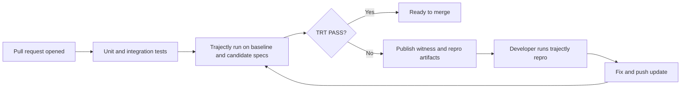
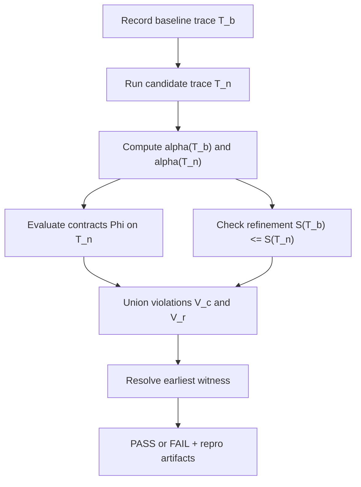
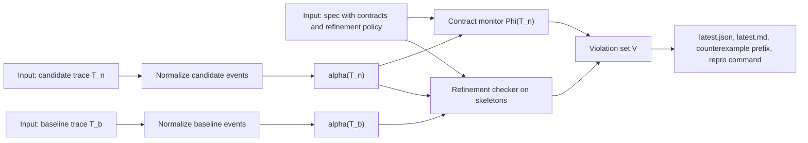
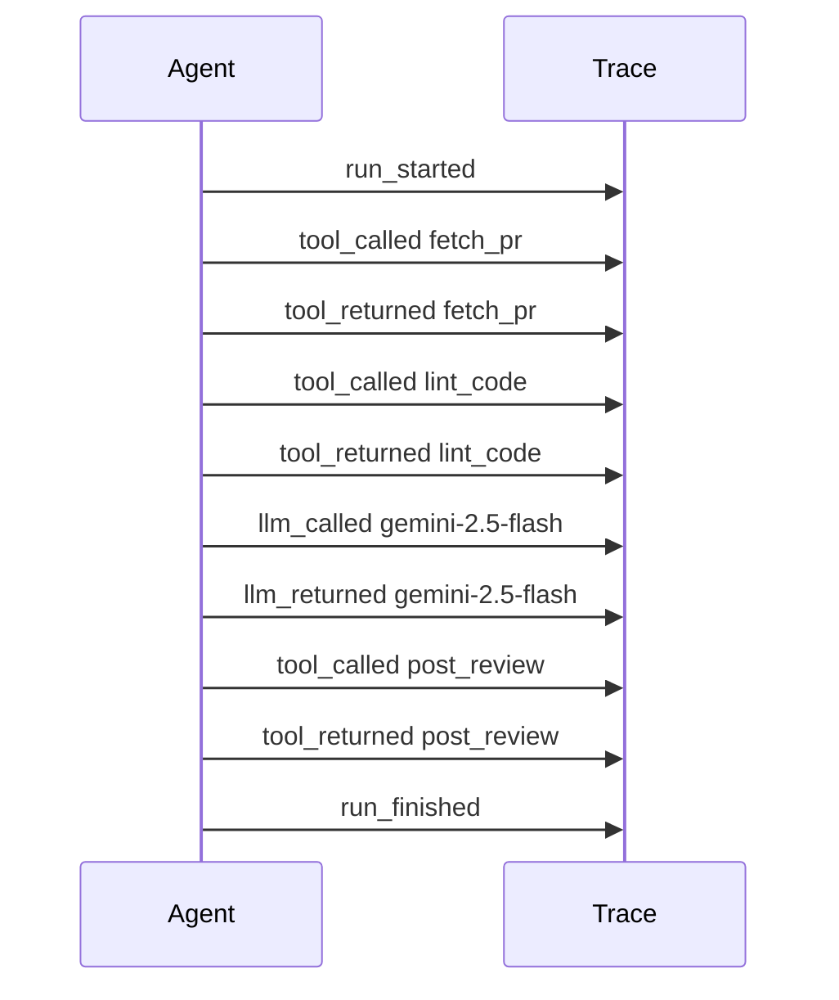
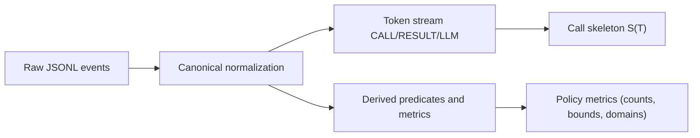
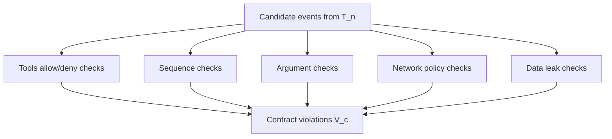
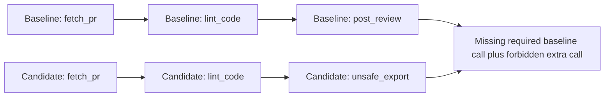
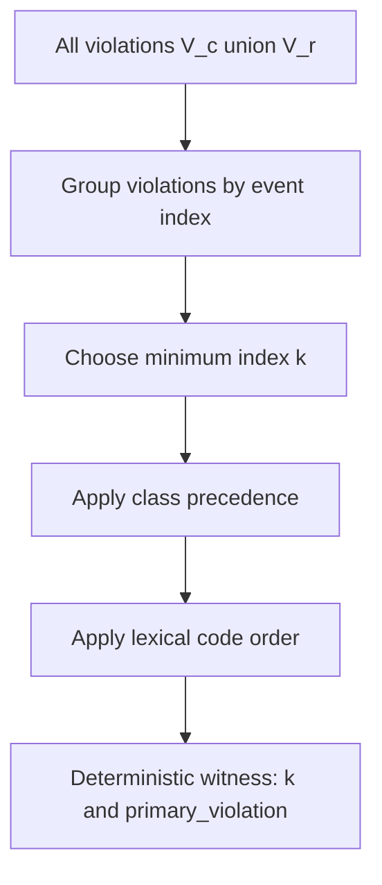
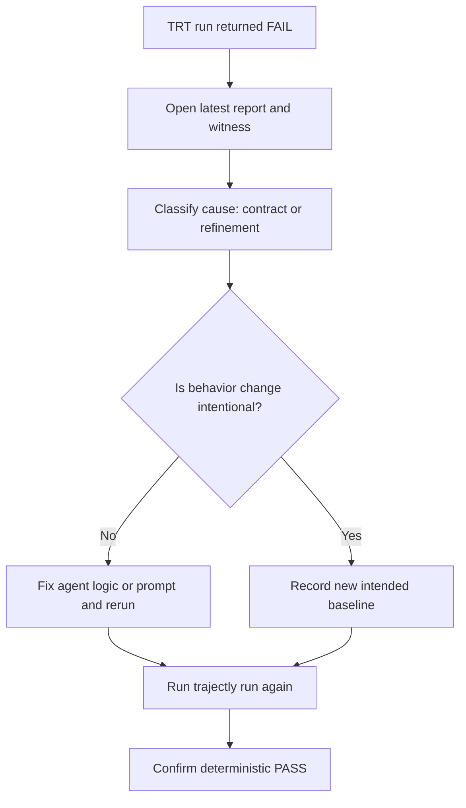

# Trajectly and TRT

Deterministic regression testing for LLM agents.

This is the single documentation page for Trajectly. It explains what Trajectly is, what Trajectory Refinement Testing (TRT)
proves, how to use it in practice, and the full command/spec/schema references.

## Table of Contents

- [1) What Is Trajectly](#1-what-is-trajectly)
- [2) What Is TRT](#2-what-is-trt)
- [3) How TRT Works](#3-how-trt-works)
- [4) Guarantees](#4-guarantees)
- [5) Quickstart (Ticket Classifier)](#5-quickstart-ticket-classifier)
- [6) CLI Reference](#6-cli-reference)
- [7) Agent Spec Reference (`.agent.yaml`, v0.3)](#7-agent-spec-reference-agentyaml-v03)
- [8) Trace Schema Reference](#8-trace-schema-reference)
- [9) Contracts Reference (`Phi` v1)](#9-contracts-reference-phi-v1)
- [10) Abstraction Reference (`alpha` v1)](#10-abstraction-reference-alpha-v1)
- [11) Platform Adapters and Example Matrix](#11-platform-adapters-and-example-matrix)
- [12) Troubleshooting](#12-troubleshooting)

---

## 1) What Is Trajectly

Trajectly turns agent behavior regressions into deterministic CI checks.

Instead of relying on heuristic output diffs, Trajectly records a known-good baseline trajectory, runs a candidate change
against the same fixtures, and returns a stable `PASS` or `FAIL` with a deterministic witness index and canonical violation.

### Value in one sentence

**Same code + same spec + same fixtures => same verdict.**

### Before vs after TRT

| Workflow step | Without TRT | With TRT |
| --- | --- | --- |
| Regression detection | Heuristic, output-diff heavy | Deterministic contract + refinement checks |
| Failure location | Manual trace reading | Earliest deterministic `witness_index` |
| Reproducibility | Often not replayable | One-command `trajectly repro` |
| CI signal | Flaky and subjective | Stable `PASS`/`FAIL` with canonical code |
| Team handoff | Hard to share exact failure state | Counterexample artifacts are replayable |

### Where TRT fits in CI



---

## 2) What Is TRT

Trajectory Refinement Testing (TRT) is Trajectly's core verification primitive for agent CI.

Given:

- baseline trace `T_b`
- new trace `T_n`
- deterministic abstraction map `alpha`
- contract monitor `Phi`
- refinement relation over call skeletons

TRT returns `PASS` iff:

1. `alpha(T_n)` satisfies configured obligations in `Phi`
2. `S(T_b) <= S(T_n)` under the configured refinement policy

If TRT fails, Trajectly emits:

- earliest witness event index
- deterministic primary violation
- all violations at witness
- counterexample prefix trace
- one-command deterministic repro

### Core objects and notation

We reason over finite traces:

```text
T = <e0, e1, ..., en>
```

Where:

- `T_b`: baseline trace
- `T_n`: candidate trace
- `alpha`: deterministic abstraction from concrete events to semantic tokens/predicates
- `Phi`: contract checks on `T_n`
- `S(T)`: tool-call skeleton extracted from `alpha(T)`

Key checks:

```text
V_c = Phi(T_n)
V_r = refine(S(T_b), S(T_n))
```

Verdict:

```text
PASS iff (V_c union V_r) is empty
FAIL otherwise
```

### Refinement scope (v1)

Skeleton refinement is computed from `TOOL_CALL` events only. `TOOL_RESULT` events are excluded in v1.

`T_n <=_skeleton T_b` iff:

1. baseline skeleton is an ordered subsequence of candidate skeleton (multiplicity-aware)
2. extra calls are allowed by policy (`allow_extra_tools`, `allow_extra_side_effect_tools`)
3. if `allow_new_tool_names=false`, unseen names are disallowed

If baseline has no `TOOL_CALL` events, skeleton refinement is vacuous.

---

## 3) How TRT Works

### 3.1 High-level pipeline



TRT is deterministic by construction: same inputs, same verdict.

### 3.2 Data and artifacts pipeline



### 3.3 Running example (Code Review Bot)

Baseline intent (`PASS`):

```yaml
name: trt-code-review-bot
command: python -m examples.code_review_bot.main
contracts:
  tools:
    allow: [fetch_pr, lint_code, post_review]
    deny: [unsafe_export]
```

Regression intent (`FAIL`):

```yaml
name: trt-code-review-bot
command: python -m examples.code_review_bot.main_regression
contracts:
  tools:
    allow: [fetch_pr, lint_code, post_review]
    deny: [unsafe_export]
```

Behavioral difference:

- baseline calls `post_review`
- regression calls `unsafe_export`

### 3.4 Trace model and event anatomy

Typical event kinds:

- `run_started`
- `agent_step`
- `tool_called` / `tool_returned`
- `llm_called` / `llm_returned`
- `run_finished`



Simplified event sample:

```json
{
  "event_type": "tool_called",
  "seq": 6,
  "payload": {
    "tool_name": "post_review",
    "input": {
      "args": ["PR-2026", "Looks good overall. Replace magic number 1.2 with named constant."],
      "kwargs": {}
    }
  }
}
```

### 3.5 Abstraction `alpha`: events to semantics

`alpha` is deterministic and pure. It converts concrete events into:

1. token stream
2. derived predicates
3. call skeleton `S(T)`



Example baseline abstraction:

- skeleton: `[fetch_pr, lint_code, post_review]`
- denied-tool count: `unsafe_export=0`

Example regression abstraction:

- skeleton: `[fetch_pr, lint_code, unsafe_export]`
- denied-tool count: `unsafe_export=1`

### 3.6 Contracts `Phi`: explicit policy checks

Contracts are checked on `T_n` and emit `V_c`.



For the regression above, contract evaluation emits `contract_tool_denied` at the violating call index.

### 3.7 Refinement: behavioral consistency

Refinement checks whether required baseline tool behavior still appears in order:

```text
S(T_b) <= S(T_n)
```

For Code Review Bot:

- baseline: `[fetch_pr, lint_code, post_review]`
- regression: `[fetch_pr, lint_code, unsafe_export]`

`post_review` is missing, so refinement fails.



### 3.8 Decision procedure and witness resolution

Given `T_b`, `T_n`, and spec `sigma`:

```text
A_b = alpha(T_b)
A_n = alpha(T_n)
V_c = Phi(T_n, sigma)
V_r = refine(S(T_b), S(T_n), sigma)
V   = V_c union V_r

if V is empty: PASS
else: FAIL with witness index k = min(v.event_index for v in V)
```

Primary violation is selected deterministically among violations at `k`.



### 3.9 Failure artifacts and repro

On failure, Trajectly writes artifacts such as:

- `.trajectly/reports/latest.json`
- `.trajectly/reports/latest.md`
- `.trajectly/repros/<spec>.counterexample.prefix.jsonl`

Reproduce deterministically:

```bash
trajectly repro
```

Optionally shrink the failing counterexample while preserving failure class:

```bash
trajectly shrink
```

---

## 4) Guarantees

TRT guarantees are observed-run and checker-relative: they apply to the concrete run being checked, under configured
abstraction `alpha`, contracts `Phi`, and refinement policy.

TRT does not claim universal correctness over all unseen executions.

### 4.1 Soundness (checker-relative)

If Trajectly returns `PASS`, then:

```text
alpha(T_n) satisfies Phi
and
S(T_b) <= S(T_n) under configured refinement policy
```

Equivalent implication:

```text
PASS => (V_c is empty) and (V_r is empty)
```

Proof sketch:

1. TRT computes `V = V_c union V_r`.
2. TRT returns `PASS` iff `V` is empty.
3. If `V` is empty, both `V_c` and `V_r` are empty.
4. Therefore configured contracts passed and refinement holds.

### 4.2 Determinism

Given identical inputs (events, spec/config, fixtures, runtime flags), Trajectly returns identical:

- verdict (`PASS`/`FAIL`)
- witness index
- primary violation code
- report payload fields

Proof sketch:

1. normalization and abstraction are deterministic
2. contract and refinement checks run in fixed deterministic order
3. witness ordering is fixed (minimum event index, class precedence, lexical code order)

### 4.3 Witness guarantee

If Trajectly returns `FAIL`, it returns:

- earliest violating event index (`witness_index`)
- all violations at that index
- deterministic primary violation

### 4.4 Completeness caveat

TRT does not prove:

- semantic correctness outside configured `alpha` and `Phi`
- correctness over all unseen future executions
- absence of all agent bugs

TRT gives deterministic compliance checks on observed/replayed behavior, not full program verification.

### 4.5 Complexity (v1)

- abstraction: `O(n)`
- contract monitor pass: `O(n)` for core checks
- skeleton refinement: `O(n)`
- shrinker (`ddmin`): bounded best-effort, often `O(n log n)` style iterations under limits

---

## 5) Quickstart (Ticket Classifier)

This is the fastest path to validate Trajectly value end-to-end.

### Prerequisites

- `trajectly` installed and available in your shell
- access to `examples` in this repository
- provider API key for selected example

### Step 1) Initialize Trajectly state

```bash
cd examples
trajectly init
```

### Step 2) Record known-good baseline

```bash
trajectly record specs/trt-support-triage-baseline.agent.yaml
```

What it does:

- runs baseline command
- stores baseline trace events
- stores fixtures for deterministic replay

### Step 3) Verify baseline passes

```bash
trajectly run specs/trt-support-triage-baseline.agent.yaml
```

Expected: `TRT status: PASS`, exit code `0`.

### Step 4) Run intentional regression

```bash
trajectly run specs/trt-support-triage-regression.agent.yaml
```

Expected: `TRT status: FAIL`, `witness_index`, `primary_violation`, `repro_command`, exit code `1`.

### Step 5) Reproduce failure offline

```bash
trajectly repro
```

This replays from fixtures without re-hitting live providers.

### Failure triage flow



### Key output fields

- `trt_status`: `PASS` or `FAIL`
- `witness_index`: earliest violating event index
- `primary_violation`: canonical failure code
- `repro_command`: deterministic repro command

---

## 6) CLI Reference

Trajectly CLI entry point: `trajectly`.

### Command index

- `trajectly init`
- `trajectly enable`
- `trajectly record`
- `trajectly run`
- `trajectly repro`
- `trajectly shrink`
- `trajectly report`
- `trajectly baseline update`
- `trajectly migrate spec`

### `trajectly init [project_root]`

Create `.trajectly/` workspace directories and starter state.

```bash
trajectly init
```

### `trajectly enable [project_root] [--template TEMPLATE]`

Enable workspace scaffolding and auto-discovery hints.

Supported templates:

- `openai`
- `langchain`
- `autogen`

```bash
trajectly enable
trajectly enable . --template openai
```

### `trajectly record [targets...] [--project-root PATH] [--auto] [--allow-ci-write]`

Record baseline traces and fixture bundles.

Writes:

- `.trajectly/baselines/*.jsonl`
- `.trajectly/fixtures/*.json`

```bash
trajectly record specs/trt-support-triage-baseline.agent.yaml
trajectly record --auto
trajectly record specs/trt-support-triage-baseline.agent.yaml --allow-ci-write
```

### `trajectly run <targets...> [--project-root PATH] [--baseline-dir PATH] [--fixtures-dir PATH] [--strict|--no-strict]`

Replay and evaluate candidate runs against recorded artifacts.

```bash
trajectly run specs/trt-support-triage-baseline.agent.yaml
trajectly run specs/trt-support-triage-regression.agent.yaml --strict
```

### `trajectly repro [selector] [--project-root PATH] [--strict|--no-strict] [--print-only]`

Reproduce latest failing spec (or selected spec) deterministically.

Selector options:

- `latest` (default)
- spec name/slug from latest report
- explicit spec path

```bash
trajectly repro --print-only
trajectly repro
trajectly repro trt-code-review-bot
```

### `trajectly shrink [selector] [--project-root PATH] [--max-seconds N] [--max-iterations N]`

Attempt to minimize a failing counterexample while preserving failure class.

```bash
trajectly shrink
trajectly shrink trt-code-review-bot --max-seconds 20 --max-iterations 500
```

### `trajectly report [--project-root PATH] [--json] [--pr-comment]`

Print latest aggregate report.

```bash
trajectly report
trajectly report --json
trajectly report --pr-comment
```

### `trajectly baseline update [targets...] [--project-root PATH] [--auto] [--allow-ci-write]`

Explicitly update baselines by re-recording selected specs.

```bash
trajectly baseline update specs/trt-code-review-bot-baseline.agent.yaml
trajectly baseline update --auto
```

Use baseline updates only for intentional, approved behavior changes.

### `trajectly migrate spec <spec_path> [--output PATH] [--in-place]`

Convert legacy spec format to v0.3 format.

```bash
trajectly migrate spec tests/legacy.agent.yaml --output tests/legacy.v03.agent.yaml
trajectly migrate spec tests/legacy.agent.yaml --in-place
```

### Exit codes

- `0`: success / no regression
- `1`: regression detected
- `2`: tooling, config, or spec error

### Common workflows

First-time setup:

```bash
trajectly init
trajectly record specs/trt-support-triage-baseline.agent.yaml
trajectly run specs/trt-support-triage-baseline.agent.yaml
```

CI regression gate:

```bash
trajectly run specs/*.agent.yaml
```

Failure triage:

```bash
trajectly report
trajectly repro
trajectly shrink
```

Intentional behavior update:

```bash
trajectly baseline update specs/trt-support-triage-baseline.agent.yaml
trajectly run specs/trt-support-triage-baseline.agent.yaml
```

---

## 7) Agent Spec Reference (`.agent.yaml`, v0.3)

Trajectly specs define how to execute an agent run and how TRT evaluates it.

### Minimal spec

```yaml
schema_version: "0.3"
name: trt-support-triage
command: python -m examples.support_triage.main
contracts:
  tools:
    allow: [fetch_ticket, store_triage]
    deny: [unsafe_export]
```

Required fields:

- `schema_version` (`"0.3"` or `"v0.3"`)
- `name`
- `command`

### Complete annotated spec

```yaml
schema_version: "0.3"
name: trt-code-review-bot
command: python -m examples.code_review_bot.main

workdir: ..
env:
  APP_ENV: ci
  FEATURE_FLAG_REVIEW: "1"

fixture_policy: by_hash
strict: true
replay:
  mode: offline
  strict_sequence: true
  llm_match_mode: signature_match
  tool_match_mode: args_signature_match
  fixture_policy: by_hash

refinement:
  mode: skeleton
  allow_extra_llm_steps: true
  allow_extra_tools: [log_event]
  allow_extra_side_effect_tools: []
  allow_new_tool_names: false
  ignore_call_tools: [log_event]

contracts:
  tools:
    allow: [fetch_pr, lint_code, post_review]
    deny: [unsafe_export]
  sequence:
    require: [fetch_pr, lint_code, post_review]
  data_leak:
    deny_pii_outbound: true
    outbound_kinds: [TOOL_CALL, LLM_REQUEST]

redact:
  - "(?i)authorization:\\s*bearer\\s+[A-Za-z0-9._-]+"
budget_thresholds:
  max_latency_ms: 10000
  max_tool_calls: 8
  max_tokens: 800
mode_profile: ci_safe
artifacts:
  dir: .trajectly/artifacts
```

### Field reference

Core:

- `schema_version`: spec schema version (`0.3` / `v0.3`)
- `name`: stable identifier used in reports
- `command`: executable command for run

Runtime:

- `workdir`: command working directory
- `env`: environment variables injected into command

Replay:

- `fixture_policy`: `by_hash` or `by_index`
- `strict`: strict replay toggle
- `replay.mode`: `offline` or `online`
- `replay.strict_sequence`: strict event sequence matching
- `replay.llm_match_mode`: `signature_match` or `sequence_match`
- `replay.tool_match_mode`: `args_signature_match` or `sequence_match`

Refinement:

- `refinement.mode`: `none`, `skeleton`, or `strict`
- `allow_extra_llm_steps`
- `allow_extra_tools`
- `allow_extra_side_effect_tools`
- `allow_new_tool_names`
- `ignore_call_tools`

Contracts:

- `tools` (allow/deny, budgets)
- `sequence` (ordering constraints)
- `side_effects` (write guards)
- `network` (allowlist/deny policy)
- `data_leak` (PII/secret checks)
- `args` (argument schema/regex checks)

Other:

- `redact`: regex redaction patterns
- `budget_thresholds`: latency/tool/token budgets
- `mode_profile`: `ci_safe`, `permissive`, or `strict`
- `artifacts.dir`: artifact output directory

---

## 8) Trace Schema Reference

Trajectly stores runtime traces as JSONL events (one event per line).

### 8.1 Event envelope

Each event includes:

- `schema_version`: current runtime schema (`v1`)
- `event_type`: event kind
- `seq`: sequence number in emission order
- `run_id`: run identifier
- `rel_ms`: relative timestamp in milliseconds
- `payload`: event-specific body
- `meta`: optional metadata map
- `event_id`: deterministic event hash (may be absent in raw input, added during normalization)

Example envelope:

```json
{
  "schema_version": "v1",
  "event_type": "tool_called",
  "seq": 8,
  "run_id": "run-01JXYZ",
  "rel_ms": 124,
  "payload": {
    "tool_name": "fetch_pr",
    "input": {
      "args": ["PR-2026"],
      "kwargs": {}
    }
  },
  "meta": {
    "provider": "gemini"
  },
  "event_id": "77d15e..."
}
```

### 8.2 Event types (runtime envelope)

Supported types:

- `run_started`
- `agent_step`
- `llm_called`
- `llm_returned`
- `tool_called`
- `tool_returned`
- `run_finished`

When they fire:

- `run_started`: run begins
- `agent_step`: logical step marker
- `llm_called`: before provider/model invocation
- `llm_returned`: after provider/model response
- `tool_called`: before tool invocation
- `tool_returned`: after tool result
- `run_finished`: run completion status

### 8.3 Annotated event examples

`run_started`:

```json
{
  "schema_version": "v1",
  "event_type": "run_started",
  "seq": 1,
  "run_id": "run-01JXYZ",
  "rel_ms": 0,
  "payload": {
    "spec_name": "trt-code-review-bot"
  },
  "meta": {}
}
```

`llm_called`:

```json
{
  "schema_version": "v1",
  "event_type": "llm_called",
  "seq": 6,
  "run_id": "run-01JXYZ",
  "rel_ms": 97,
  "payload": {
    "provider": "gemini",
    "model": "gemini-2.5-flash",
    "prompt": "Review this diff and lint summary..."
  },
  "meta": {}
}
```

`tool_returned`:

```json
{
  "schema_version": "v1",
  "event_type": "tool_returned",
  "seq": 9,
  "run_id": "run-01JXYZ",
  "rel_ms": 155,
  "payload": {
    "tool_name": "post_review",
    "output": {
      "status": "posted",
      "pr_id": "PR-2026"
    }
  },
  "meta": {}
}
```

### 8.4 Normalized TRT event view (v0.3)

TRT normalizes runtime events into objects with fields like:

- `event_index`
- `kind` (`TOOL_CALL`, `TOOL_RESULT`, `LLM_REQUEST`, `LLM_RESPONSE`, etc.)
- `payload`
- `stable_hash`

Abstraction and refinement consume this normalized representation.

### 8.5 Compatibility and validation

- missing `schema_version` in runtime input is treated as `v1`
- unsupported versions fail with migration guidance
- `event_id` is computed deterministically if absent
- invalid event shapes fail schema validation

---

## 9) Contracts Reference (`Phi` v1)

`phi.yaml` contains policy only. Do not place `refinement` in `phi.yaml`.

```yaml
schema_version: "0.3"
contracts:
  version: v1
  tools:
    allow: []
    deny: []
    max_calls_total: 10
    max_calls_per_tool: {}
  sequence:
    require: []
    forbid: []
    require_before: []
    eventually: []
    never: []
    at_most_once: []
  side_effects:
    deny_write_tools: true
  network:
    default: deny
    allowlist: []
    allow_domains: []
  data_leak:
    deny_pii_outbound: true
    outbound_kinds: [TOOL_CALL, LLM_REQUEST]
  args:
    tool_name:
      required_keys: []
      fields: {}
```

Supported obligation families:

- tool allow/deny
- max call budgets (global + per-tool)
- sequence constraints (`require_before`, `eventually`, `never`, `at_most_once`)
- side-effect guard (`deny_write_tools`)
- network policy
- outbound PII checks
- argument checks (`required_keys`, `type`, `min`, `max`, `enum`, `regex`)

Stable codes include:

- `FIXTURE_EXHAUSTED`
- `NORMALIZER_VERSION_MISMATCH`

---

## 10) Abstraction Reference (`alpha` v1)

Abstraction maps concrete events into tokens and derived predicates.

### Default tokens

- `TOOL_CALL -> CALL(tool_name)`
- `TOOL_RESULT -> RESULT(tool_name)`
- `LLM_REQUEST -> LLM_REQUEST(model)`
- `LLM_RESPONSE -> LLM_RESPONSE(model)`
- `MESSAGE -> MESSAGE`
- `OBSERVATION -> OBSERVATION`
- `ERROR -> ERROR`

### Predicate extractors (v1)

- `pii`: email/phone regex detectors
- `price`: numeric extraction from configured paths
- `refund_count`: count of refund tool calls

### Determinism rules

- abstraction is pure (no I/O, no randomness)
- normalization uses one canonical pipeline
- volatile fields are stripped before hashing/signatures/predicate extraction

### Common refinement controls in `.agent.yaml`

```yaml
refinement:
  mode: skeleton
  allow_extra_llm_steps: true
  allow_extra_tools: ["log_event"]
  allow_extra_side_effect_tools: []
  allow_new_tool_names: false
  ignore_call_tools: ["log_event"]
```

---

## 11) Platform Adapters and Example Matrix

Trajectly currently covers four adapter paths:

1. OpenAI
2. Gemini
3. LangGraph (OpenAI backend)
4. LlamaIndex (OpenAI backend)

### Adapter integration model

Trajectly does not require framework-specific checker logic. Adapters integrate through a shared event model:

1. agent executes framework/provider call
2. SDK emits trace events (`llm_called`, `tool_called`, etc.)
3. Trajectly records baseline and fixtures
4. TRT replays and checks contracts/refinement deterministically

### Adapter matrix (8 main example pairs)

| Adapter | Provider path | Example pairs | Example entrypoints |
| --- | --- | --- | --- |
| OpenAI | Direct OpenAI chat completion | `trt-support-triage`, `trt-search-buy` | `examples/support_triage/main.py`, `examples/search_buy/main.py` |
| Gemini | Direct Gemini path | `trt-code-review-bot`, `trt-travel-planner` | `examples/code_review_bot/main.py`, `examples/travel_planner/main.py` |
| LlamaIndex | LlamaIndex OpenAI integration | `trt-rag-agent`, `trt-sql-agent` | `examples/rag_agent/main.py`, `examples/sql_agent/main.py` |
| LangGraph | LangGraph workflow with OpenAI backend | `trt-payments-agent`, `trt-support-agent` | `examples/payments_agent/main.py`, `examples/support_agent/main.py` |

### Spec files by adapter

OpenAI:

- `specs/trt-support-triage-baseline.agent.yaml`
- `specs/trt-support-triage-regression.agent.yaml`
- `specs/trt-search-buy-baseline.agent.yaml`
- `specs/trt-search-buy-regression.agent.yaml`

Gemini:

- `specs/trt-code-review-bot-baseline.agent.yaml`
- `specs/trt-code-review-bot-regression.agent.yaml`
- `specs/trt-travel-planner-baseline.agent.yaml`
- `specs/trt-travel-planner-regression.agent.yaml`

LlamaIndex:

- `specs/trt-rag-agent-baseline.agent.yaml`
- `specs/trt-rag-agent-regression.agent.yaml`
- `specs/trt-sql-agent-baseline.agent.yaml`
- `specs/trt-sql-agent-regression.agent.yaml`

LangGraph:

- `specs/trt-payments-agent-baseline.agent.yaml`
- `specs/trt-payments-agent-regression.agent.yaml`
- `specs/trt-support-agent-baseline.agent.yaml`
- `specs/trt-support-agent-regression.agent.yaml`

### Run all 8 baselines

```bash
cd examples
trajectly init

trajectly record \
  specs/trt-support-triage-baseline.agent.yaml \
  specs/trt-search-buy-baseline.agent.yaml \
  specs/trt-code-review-bot-baseline.agent.yaml \
  specs/trt-travel-planner-baseline.agent.yaml \
  specs/trt-rag-agent-baseline.agent.yaml \
  specs/trt-sql-agent-baseline.agent.yaml \
  specs/trt-payments-agent-baseline.agent.yaml \
  specs/trt-support-agent-baseline.agent.yaml
```

### Run all 8 regressions

```bash
trajectly run \
  specs/trt-support-triage-regression.agent.yaml \
  specs/trt-search-buy-regression.agent.yaml \
  specs/trt-code-review-bot-regression.agent.yaml \
  specs/trt-travel-planner-regression.agent.yaml \
  specs/trt-rag-agent-regression.agent.yaml \
  specs/trt-sql-agent-regression.agent.yaml \
  specs/trt-payments-agent-regression.agent.yaml \
  specs/trt-support-agent-regression.agent.yaml
```

---

## 12) Troubleshooting

### `FIXTURE_EXHAUSTED`

Cause:

- replay requested more matching fixtures than recorded

Fix:

1. re-record baseline for intended behavior
2. verify matcher mode (`args_signature_match` / `signature_match`)
3. check that deterministic arguments are not drifting

### `NORMALIZER_VERSION_MISMATCH`

Cause:

- baseline artifact was produced with a different normalizer version

Fix:

1. re-record baseline with current Trajectly
2. keep local and CI pinned to the same Trajectly version

### Replay network blocked

Cause:

- offline mode blocks DNS/socket/http/websocket/subprocess networking

Fix:

1. keep CI offline and rely on fixtures (recommended)
2. only allowlist explicitly approved domains/tools when needed

### CI baseline write denied

Cause:

- `TRAJECTLY_CI=1` blocks baseline writes by default

Fix:

1. do not update baselines in standard CI checks
2. for intentional update jobs, use `trajectly record ... --allow-ci-write`

### Shrinker did not reduce

Cause:

- no smaller candidate preserved TRT failure class within configured bounds

Fix:

1. increase `--max-seconds` or `--max-iterations`
2. keep original counterexample prefix; it is still valid
