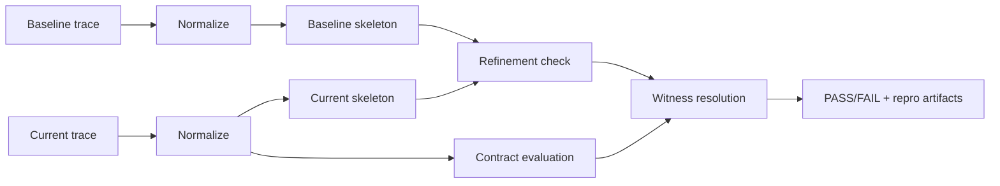

# Trajectly

Deterministic regression testing for AI agents with **Trajectory Refinement Testing (TRT)**.

Trajectly records a baseline run, replays with fixtures, evaluates contracts plus behavioral refinement, and reports the earliest failing trace event (witness index).

## Table of contents

- [1) Quickstart](#1-quickstart)
- [2) Core concepts](#2-core-concepts)
- [3) TRT algorithm](#3-trt-algorithm)
- [4) Daily workflow](#4-daily-workflow)
- [5) CLI reference](#5-cli-reference)
- [6) Spec reference](#6-spec-reference)
- [7) SDK reference](#7-sdk-reference)
- [8) Trace schema reference](#8-trace-schema-reference)
- [9) Contracts reference](#9-contracts-reference)
- [10) Troubleshooting](#10-troubleshooting)

---

## 1) Quickstart

If `trajectly` is not on your `PATH`, run commands as `python -m trajectly ...` using the same interpreter where Trajectly is installed.

### Run a deterministic regression demo

```bash
git clone https://github.com/trajectly/procurement-approval-demo.git
cd procurement-approval-demo
python3.11 -m venv .venv
source .venv/bin/activate
python -m pip install --upgrade pip
python -m pip install -r requirements.txt

python -m trajectly run specs/trt-procurement-agent-regression.agent.yaml --project-root .
python -m trajectly report
python -m trajectly repro
python -m trajectly shrink
```

Expected exit behavior for this intentional regression:
- `run ...regression...` -> `1`
- `report` -> `0`
- `repro` -> `1`
- `shrink` -> `0`

Observed output excerpts from a fresh run (March 5, 2026):

```text
# run ...regression...
- `trt-procurement-agent`: regression
  - trt: `FAIL` (witness=10)

# report
Source: $PROJECT_ROOT/.trajectly/reports/latest.md

# repro
Repro command: python -m trajectly run "$PROJECT_ROOT/specs/trt-procurement-agent-regression.agent.yaml" --project-root "$PROJECT_ROOT"

# shrink
Shrink completed and report updated with shrink stats.
```

Artifacts produced by this flow:
- `$PROJECT_ROOT/.trajectly/reports/latest.md`
- `$PROJECT_ROOT/.trajectly/reports/latest.json`
- `$PROJECT_ROOT/.trajectly/repros/<spec>.json`
- `$PROJECT_ROOT/.trajectly/repros/<spec>.counterexample.reduced.trace.jsonl`

### Record your own baseline

```bash
python -m trajectly init
python -m trajectly record specs/my-agent.agent.yaml --project-root .
python -m trajectly run specs/my-agent.agent.yaml --project-root .
```

`specs/my-agent.agent.yaml` is a placeholder. Replace with an existing spec path.

Observed output cue:

```text
Initialized Trajectly workspace at $PROJECT_ROOT
Recorded 1 spec(s) successfully
- `my-agent`: clean
  - trt: `PASS`
```

---

## 2) Core concepts

### Baseline

A baseline is the known-good behavior for a spec. Trajectly stores baseline traces plus fixtures for deterministic replay.

In practice, a baseline is both a regression reference and a versioned artifact. When you create `v1`, you are saying "this behavior is currently acceptable," and every future `run` compares against that decision. Baselines can be promoted or updated as your intended behavior evolves, which keeps changes explicit and reviewable instead of implicit.

### Replay

In replay mode, tool and LLM calls are matched against fixtures and returned deterministically. This removes online nondeterminism from regression checks.

Replay is what makes CI results stable. Instead of depending on live model variance, network timing, or changing upstream APIs, Trajectly reuses recorded fixtures and deterministic matching so the same code path can be validated repeatedly. This makes failures reproducible locally through `repro`, not just visible in CI logs.

### Contracts

Contracts define allowed behavior (tool allow/deny, sequence constraints, budgets, network/data policies, argument rules).

Contracts encode policy, not implementation. You can change internal prompt wording or refactor node composition while still asserting hard constraints such as "never call this tool" or "approval must happen before purchase order creation." This lets teams separate acceptable behavior from incidental code structure.

### Refinement

Trajectly extracts ordered tool-call skeletons and verifies baseline skeleton is a subsequence of current skeleton.

Refinement catches behavioral drift even when outputs look superficially valid. If the baseline required key tool calls and the new run skipped or replaced them, refinement flags the divergence. This is especially useful for agent systems where final text alone can hide protocol-level regressions.

### Witness index

When checks fail, Trajectly reports the earliest failing trace event index.

The witness index gives a deterministic anchor for triage. Instead of scanning entire traces, you can jump directly to the first event where behavior diverged from policy or baseline. This reduces ambiguity and makes bug reports easier to share because everyone can reference the same failing position.

Important:
- witness index is a **trace event index** (0-based)
- trace event index is distinct from violation list ordering in report summaries

---

## 3) TRT algorithm

TRT answers: "Did behavior violate policy or diverge from baseline?" instead of "Did output text change?"


```mermaid
flowchart LR
    Tb["Baseline trace"] --> Nb["Normalize"]
    Tn["Current trace"] --> Nn["Normalize"]
    Nb --> Sb["Baseline skeleton"]
    Nn --> Sn["Current skeleton"]
    Sb --> R["Refinement check"]
    Sn --> R
    Nn --> C["Contract evaluation"]
    R --> W["Witness resolution"]
    C --> W
    W --> V["PASS/FAIL + repro artifacts"]
```

### Stage 1: normalization

Canonicalization removes unstable noise (timestamps, volatile ids, shape differences) so equivalent behavior compares deterministically.

Normalization is the prerequisite for meaningful comparison. Without it, harmless differences such as generated IDs or clock values would look like regressions. By canonicalizing event payloads first, TRT compares behavioral structure rather than incidental runtime noise.

### Stage 2: skeleton extraction

Tool-call sequence is extracted from normalized trace.

The skeleton is a compact behavioral summary of the run. Instead of comparing every raw field, TRT captures the ordered sequence of meaningful operations, which keeps checks robust and explainable. This abstraction also supports clear failure reporting when required calls are missing.

### Stage 3: refinement

Baseline skeleton must appear in current skeleton in the same relative order (subsequence relation).

This stage answers whether the current run still refines baseline behavior. Additional safe steps are allowed, but removing or reordering critical baseline operations is not. The subsequence rule balances flexibility for iterative improvements with strict protection against unintended behavioral shortcuts.

### Stage 4: contracts

Current trace is checked against contracts independently of refinement.

Contracts and refinement are intentionally independent checks. A run can preserve baseline skeleton and still violate a policy rule (for example, calling a denied tool), or pass contracts but drift from baseline behavior. Keeping both checks separate improves diagnostic precision in reports.

### Witness resolution

If any violation exists, TRT chooses the earliest failing event index as witness.

When multiple findings exist, witness resolution chooses a deterministic first failure point. This prevents noisy or order-dependent reporting and ensures repeated runs point to the same anchor event. Stable witness selection is critical for reproducible CI gating and for minimizing counterexamples with `shrink`.

Practical impact:
- deterministic CI gate
- deterministic repro (`python -m trajectly repro`)
- counterexample minimization (`python -m trajectly shrink`)

---

## 4) Daily workflow

### Setup once

Initialize `.trajectly/` at the project root before recording or replaying. This creates the local workspace layout Trajectly uses for baselines, current traces, reports, and repro artifacts. You typically run this once per repository, then only repeat if you intentionally reset workspace state.

```bash
python -m trajectly init
```

Output cue:

```text
Initialized Trajectly workspace at $PROJECT_ROOT
```

### Record baseline

Record captures a known-good run and stores both trace and fixtures under the spec slug/version. This step should be done from a commit where behavior is trusted, because it becomes your comparison reference. If recording in CI, use `--allow-ci-write` only for explicit baseline-management workflows.

```bash
python -m trajectly record specs/*.agent.yaml --project-root .
```

Output cue:

```text
Recorded 1 spec(s) successfully
```

### Validate changes

Use `run` and `report` together in day-to-day development and CI. `run` executes TRT checks and sets the gate exit code, while `report` gives readable detail and repro metadata. This two-step loop makes it easy to fail fast and then inspect exactly why.

```bash
python -m trajectly run specs/*.agent.yaml --project-root .
python -m trajectly report
```

Output cues:

```text
# clean run
- `my-agent`: clean
  - trt: `PASS`

# regression run
- `my-agent`: regression
  - trt: `FAIL` (witness=...)
Source: $PROJECT_ROOT/.trajectly/reports/latest.md
```

### If failing

When `run` fails, `repro` gives a one-command deterministic replay of the failing case, and `shrink` reduces the failing trace to a smaller counterexample. These commands are designed for debugging speed: reproduce first, then minimize. Most triage loops should start here before changing code or baselines.

```bash
python -m trajectly repro
python -m trajectly shrink
```

Output cues:

```text
Repro command: python -m trajectly run "$PROJECT_ROOT/specs/my-agent.agent.yaml" --project-root "$PROJECT_ROOT"
Shrink completed and report updated with shrink stats.
```

### If change is intentional

If behavior changed on purpose, version the baseline instead of silently replacing history. Create a new version, validate it, and promote only when you are ready for future runs to compare against the new intended behavior. This keeps behavioral changes auditable in PR review and release history.

```bash
python -m trajectly baseline create --name v2 specs/my-agent.agent.yaml --project-root .
python -m trajectly baseline promote v2 specs/my-agent.agent.yaml --project-root .
```

Output cues:

```text
Created baseline version `v2` for 1 spec(s)
{
  "promoted": ["my-agent"],
  "version": "v2"
}
```

---

## 5) CLI reference

The command surface below reflects current `python -m trajectly --help` output.

Output snippets in this section were captured from fresh runs on March 5, 2026. Paths are normalized to `$PROJECT_ROOT`.

### Top-level commands

The top-level command surface follows the baseline workflow: initialize, record, validate, triage, then manage baseline versions. If you are onboarding, focus first on `init`, `record`, `run`, `report`, and `repro`; baseline lifecycle commands become relevant when behavior changes intentionally.

| Command | Purpose |
|---|---|
| `python -m trajectly --version` | Print version |
| `python -m trajectly init [PROJECT_ROOT]` | Initialize `.trajectly/` workspace |
| `python -m trajectly enable [PROJECT_ROOT] [--template ...]` | Scaffold and auto-discover setup |
| `python -m trajectly record [TARGETS]... [--auto] [--project-root ...] [--allow-ci-write]` | Record baselines and fixtures |
| `python -m trajectly run TARGETS... [--project-root ...] [--baseline ...] [--strict/--no-strict]` | Run TRT checks |
| `python -m trajectly repro [SELECTOR] [--project-root ...] [--strict/--no-strict] [--print-only]` | Reproduce latest/selected regression |
| `python -m trajectly shrink [SELECTOR] [--project-root ...] [--max-seconds ...] [--max-iterations ...]` | Minimize failing trace |
| `python -m trajectly report [--project-root ...] [--json] [--pr-comment]` | Print latest aggregate report |
| `python -m trajectly baseline ...` | Baseline lifecycle commands |

### `init`

Use `init` to create or refresh local Trajectly workspace metadata at a chosen project root. It does not run agent code; it only prepares directories/config expected by subsequent commands.

```bash
python -m trajectly init
python -m trajectly init ./my-project
```

Observed output:

```text
Initialized Trajectly workspace at $PROJECT_ROOT
```

### `enable`

Use `enable` for first-time scaffolding when a project has no specs yet. It creates starter files and can apply a template so you can run `record --auto` quickly without manually wiring everything.

```bash
python -m trajectly enable
python -m trajectly enable . --template openai
```

Supported templates include `openai`, `langchain`, and `autogen`.

Observed output (`--template openai`):

```text
Enabled Trajectly workspace at $PROJECT_ROOT
Applied template: openai
Template files created:
- $PROJECT_ROOT/templates/openai_agent.py
- $PROJECT_ROOT/openai.agent.yaml
Next step: python -m trajectly record --auto
```

### `record`

`record` executes spec commands in record mode and writes baseline artifacts. Run it after confirming the current behavior is acceptable, because these artifacts become your deterministic replay reference.

Signature:

```text
python -m trajectly record [TARGETS]... [--project-root PATH] [--auto] [--allow-ci-write]
```

Examples:

```bash
python -m trajectly record specs/my-agent.agent.yaml --project-root .
python -m trajectly record --auto --project-root .
```

Observed output:

```text
Recorded 1 spec(s) successfully
```

### `run`

`run` is the main regression gate. It replays against baseline fixtures, evaluates TRT (refinement + contracts), writes report artifacts, and returns an exit code suitable for CI policy enforcement.

Signature:

```text
python -m trajectly run TARGETS... [--project-root PATH] [--baseline-dir PATH] [--fixtures-dir PATH] [--baseline VERSION] [--strict/--no-strict]
```

Examples:

```bash
python -m trajectly run specs/my-agent.agent.yaml --project-root .
python -m trajectly run specs/*.agent.yaml --project-root . --baseline v2
```

Exit codes:
- `0` = all passing
- `1` = one or more regressions
- `2` = config/internal/tooling error

Observed output cues:

```text
# pass
- `trt-procurement-agent`: clean
  - trt: `PASS`

# fail
- `trt-procurement-agent`: regression
  - trt: `FAIL` (witness=10)
```

### `repro`

`repro` reruns the latest or selected failing case with deterministic inputs. Use `--print-only` when you want to copy the exact command into logs or bug reports without executing it immediately.

Signature:

```text
python -m trajectly repro [SELECTOR] [--project-root PATH] [--strict/--no-strict] [--print-only]
```

Examples:

```bash
python -m trajectly repro
python -m trajectly repro my-agent
python -m trajectly repro --print-only
```

Observed output:

```text
# --print-only
Repro command: python -m trajectly run "$PROJECT_ROOT/specs/trt-procurement-agent-regression.agent.yaml" --project-root "$PROJECT_ROOT"

# execute repro
- `trt-procurement-agent`: regression
  - trt: `FAIL` (witness=10)
```

### `shrink`

`shrink` minimizes a failing counterexample while preserving the same failure class. It is most useful after `repro` confirms a stable failure and you want a smaller trace for root-cause analysis.

Signature:

```text
python -m trajectly shrink [SELECTOR] [--project-root PATH] [--max-seconds FLOAT] [--max-iterations INT]
```

Examples:

```bash
python -m trajectly shrink
python -m trajectly shrink my-agent --max-seconds 20 --max-iterations 500
```

Observed output:

```text
Shrink completed and report updated with shrink stats.
Latest report: $PROJECT_ROOT/.trajectly/reports/latest.md
```

### `report`

`report` renders the latest aggregate result in human-readable or machine-readable formats. Use markdown for local inspection, JSON for automation, and `--pr-comment` when integrating with CI comment bots.

```bash
python -m trajectly report
python -m trajectly report --json
python -m trajectly report --pr-comment
```

Observed output cues:

```text
# report
Source: $PROJECT_ROOT/.trajectly/reports/latest.md

# report --json (excerpt)
"regressions": 1
"trt_failure_class": "REFINEMENT"

# report --pr-comment (excerpt)
### Trajectly Regression Report
- Specs processed: **1**
- Regressions: **1**
```

### Baseline commands

Baseline commands manage version history for intended behavior. Use them when you need explicit behavioral evolution (`v1` -> `v2`) rather than ad-hoc re-recording.

#### `baseline list`

`baseline list` shows which spec slugs have stored versions and which version is currently promoted. This is useful when auditing repository state before promotion or update operations.

```text
python -m trajectly baseline list [TARGETS]... [--project-root PATH]
```

```bash
python -m trajectly baseline list
python -m trajectly baseline list specs/my-agent.agent.yaml
```

Observed output (excerpt):

```json
{
  "schema_version": "v1",
  "specs": [
    {
      "slug": "trt-procurement-agent",
      "promoted": "v1",
      "versions": ["v1"]
    }
  ]
}
```

#### `baseline create`

`baseline create` records a new named baseline version without changing the currently promoted version. This is the safest way to stage intentional behavior updates for review.

```text
python -m trajectly baseline create --name VERSION TARGETS... [--project-root PATH] [--allow-ci-write]
```

`TARGETS...` is required.

```bash
python -m trajectly baseline create --name v2 specs/my-agent.agent.yaml --project-root .
```

Observed output:

```text
Created baseline version `v2` for 1 spec(s)
```

#### `baseline promote`

`baseline promote` switches the comparison target to an existing version. Use it only after validating the target version, because subsequent `run` commands will treat that version as the source of truth.

```text
python -m trajectly baseline promote VERSION [TARGETS]... [--project-root PATH]
```

```bash
python -m trajectly baseline promote v2 specs/my-agent.agent.yaml --project-root .
```

Observed output (excerpt):

```json
{
  "promoted": ["trt-procurement-agent"],
  "version": "v2"
}
```

#### `baseline diff`

`baseline diff` compares two stored baseline versions for a spec slug. It is useful in code review to show how behavior changed between versions before deciding whether to promote.

```text
python -m trajectly baseline diff SPEC_SLUG LEFT RIGHT [--project-root PATH] [--json]
```

```bash
python -m trajectly baseline diff my-agent v1 v2 --project-root .
python -m trajectly baseline diff my-agent v1 v2 --json
```

Observed output (`--json`, excerpt):

```json
{
  "slug": "trt-procurement-agent",
  "left": "v1",
  "right": "v2",
  "summary": {
    "regression": false,
    "finding_count": 0
  }
}
```

#### `baseline update`

`baseline update` re-records currently targeted specs in place (or auto-discovered specs with `--auto`). Use this command when updates are intentional and you want the active baseline refreshed directly.

```text
python -m trajectly baseline update [TARGETS]... [--project-root PATH] [--auto] [--allow-ci-write]
```

```bash
python -m trajectly baseline update specs/my-agent.agent.yaml --project-root .
python -m trajectly baseline update --auto --project-root .
```

Observed output:

```text
Updated baseline for 1 spec(s)
```

---

## 6) Spec reference

Trajectly specs are `.agent.yaml` files.

Think of a spec as an executable policy file: it tells Trajectly what command to run, where to run it, and what constraints should be enforced during replay and validation. Most teams keep specs under `specs/` and version them alongside application code so behavior expectations evolve with code changes.

### Minimal example

This minimal form is enough to start recording and validating a simple agent. As your workflow matures, you usually add `strict`, replay matching controls, and contracts to make regression checks both deterministic and policy-aware.

```yaml
schema_version: "0.4"
name: my-agent
command: python -m agents.my_agent
contracts:
  tools:
    allow: [fetch_data, summarize]
```

Required fields:
- `schema_version`
- `name`
- `command`

### Annotated example (realistic)

```yaml
schema_version: "0.4"
name: procurement-agent
command: python agents/procurement_agent.py
workdir: .
strict: true
fixture_policy: by_hash
env:
  TRAJECTLY_DEMO_USE_OPENAI: "0"
contracts:
  tools:
    allow: [fetch_requisition, fetch_vendor_quotes, route_for_approval, create_purchase_order]
    deny: [unsafe_direct_award]
  sequence:
    require: [tool:fetch_requisition, tool:fetch_vendor_quotes, tool:route_for_approval, tool:create_purchase_order]
    require_before:
      - before: tool:route_for_approval
        after: tool:create_purchase_order
```

Why this pattern is commonly used:
1. `strict: true` prevents silent replay mismatches.
2. `fixture_policy: by_hash` keeps fixture matching deterministic.
3. `contracts.tools` and `contracts.sequence` enforce policy and ordering, not just final text output.

### Common fields

Use common fields to control execution determinism and policy granularity. Start with `workdir`, `env`, and `contracts`, then add tighter controls (`determinism`, `budget_thresholds`, `redact`) when your CI and compliance requirements grow.

| Field | Purpose |
|---|---|
| `schema_version` | Spec schema version (`0.4`) |
| `name` | Human-readable spec name |
| `command` | Command used by runtime subprocess |
| `workdir` | Optional run working directory |
| `env` | Env overrides |
| `contracts` | Policy constraints |
| `replay` | Replay matching configuration |
| `refinement` | Refinement behavior controls |
| `determinism` | Determinism-related runtime controls |
| `redact` | Regex redaction patterns |
| `budget_thresholds` | Max latency/tool calls/tokens |
| `artifacts_dir` | Artifact output directory |

### Spec inheritance (`extends`)

`extends` allows a base policy to be shared across multiple variants while keeping child specs concise. This is especially useful when many specs share the same guardrails but differ in one or two fields such as command, environment, or denied tools.

```yaml
# child.agent.yaml
extends: ./base.agent.yaml
name: my-agent-variant
contracts:
  tools:
    deny: [unsafe_export]
```

Merge semantics:
- dicts merge recursively
- lists and scalars override parent values

---

## 7) SDK reference

Trajectly supports two SDK styles that share the same runtime instrumentation path.

### Choosing an SDK style

1. Use decorators when you already have plain Python functions and want minimal integration work.
2. Use `trajectly.App` when you want explicit DAG structure, node dependencies, and generated spec scaffolding.
3. Both styles emit the same trace event types and use the same CLI/report pipeline.

### A) Decorators

Decorators are the most direct integration path when your agent is already implemented as plain Python functions. You annotate tool and model call boundaries, then keep the rest of your control flow unchanged.

```python
from trajectly.sdk import tool, llm_call

@tool("fetch_ticket")
def fetch_ticket(ticket_id: str) -> dict:
    return {"id": ticket_id}

@llm_call(provider="openai", model="gpt-4o")
def classify_ticket(prompt: str) -> str:
    ...
```

### B) Declarative graph (`trajectly.App`)

The graph API is useful when you want execution structure to be explicit and validated up front. Node registration, dependency mapping, and deterministic topological execution make control flow easier to inspect and reason about.

```python
import trajectly

app = trajectly.App(name="support-agent")

@app.node(id="fetch_ticket", type="tool")
def fetch_ticket(ticket_id: str) -> dict:
    ...

@app.node(id="classify", type="llm", depends_on=["fetch_ticket"], provider="openai", model="gpt-4o")
def classify(fetch_ticket: dict) -> str:
    ...

@app.node(id="format", type="transform", depends_on=["classify"])
def format_output(classify: str) -> dict:
    return {"answer": classify}

if __name__ == "__main__":
    outputs = app.run(input_data={"ticket_id": "T-123"})
    print(outputs["format"])
```

### Graph API objects

These objects represent the declarative graph model and validation surface. In day-to-day usage, most users interact with `App`, while `NodeSpec`/`GraphSpec` and `GraphError` become relevant when debugging graph construction or building higher-level tooling.

- `trajectly.App`: graph registration and execution
- `trajectly.sdk.graph.NodeSpec`: immutable node definition
- `trajectly.sdk.graph.GraphSpec`: validated graph snapshot (nodes, topological order, input keys)
- `trajectly.sdk.graph.GraphError`: static graph validation errors
- `trajectly.sdk.graph.scan_module(module)`: discover decorated node specs

### `App.node(...)` semantics

`App.node(...)` defines both execution role (`tool`/`llm`/`transform`/`input`) and data dependencies. Explicit dependency mapping is preferred for non-trivial graphs because it prevents accidental parameter ordering mistakes and improves readability.

Node types:
- `tool`
- `llm`
- `input`
- `transform`

Dependencies:
- `depends_on=["a", "b"]` -> positional parameter mapping
- `depends_on={"param": "source_node"}` -> explicit mapping
- `depends_on=None` -> parameters resolve from `input_data` or previous node ids

### Deterministic order

Graph execution uses deterministic topological ordering (lexicographic tie-break for same indegree).

Deterministic ordering is essential for stable traces. If two nodes are otherwise unordered, deterministic tie-breaking prevents run-to-run variance in event sequences that would otherwise create noisy diffs.

### Event mapping

Graph execution emits the same event types used everywhere else:
- `tool_called` / `tool_returned` via `ctx.invoke_tool`
- `llm_called` / `llm_returned` via `ctx.invoke_llm`
- `agent_step` markers for graph lifecycle and transform stages

No new event type is introduced for graph mode.

This shared event model means graph-mode and decorator-mode projects use the same replay engine, report schema, and CI workflow. You can switch instrumentation style without rewriting your validation pipeline.

### `generate_spec(...)`

`App.generate_spec()` returns a `.agent.yaml`-compatible dictionary template:
- fills `schema_version`, `name`, placeholder `command`
- derives tool allowlist and sequence requirements from graph tool nodes
- allows deep-merged overrides

This is useful when you want policy scaffolding generated from code structure, then refined manually. It reduces setup drift between graph nodes and contract expectations.

### Framework adapters

For framework-native integration, use wrappers from `trajectly.sdk` such as:
- `openai_chat_completion`
- `gemini_generate_content`
- `langchain_invoke`
- `anthropic_messages_create`
- `llamaindex_query`

Adapters let you preserve framework-native call sites while still emitting canonical Trajectly events. That keeps migration cost low for existing projects that do not want to rewrite their orchestration layer.

---

## 8) Trace schema reference

Trajectly stores traces as JSONL (one event per line).

Each line is an independently parseable event record, which makes traces easy to stream, diff, and process with standard tooling. The schema is designed so local debugging and CI artifact inspection use the same data format.

### Event envelope

The envelope fields provide deterministic ordering, run identity, and payload context. Together they allow trace reconstruction even when events are consumed outside Trajectly (for example by custom analytics scripts).

| Field | Meaning |
|---|---|
| `schema_version` | Trace event schema version (`"v1"`) |
| `event_type` | Event kind |
| `seq` | Emission sequence number |
| `run_id` | Run identifier |
| `rel_ms` | Milliseconds since run start |
| `payload` | Event-specific payload |
| `meta` | Optional metadata |
| `event_id` | Deterministic event hash (if present) |

### Event types

Event types capture the lifecycle from run start to run finish and the key instrumented boundaries in between. Tool and LLM call pairs (`*_called` / `*_returned`) provide the structure TRT uses for refinement and contract checks.

| Event type | Meaning |
|---|---|
| `run_started` | Runtime start marker |
| `agent_step` | Logical step marker |
| `tool_called` | Tool invocation started |
| `tool_returned` | Tool invocation finished |
| `llm_called` | LLM invocation started |
| `llm_returned` | LLM invocation finished |
| `run_finished` | Runtime completion marker |

Example:

```json
{
  "schema_version": "v1",
  "event_type": "tool_called",
  "seq": 6,
  "run_id": "run-01H...",
  "rel_ms": 124,
  "payload": {
    "tool_name": "fetch_data",
    "input": {"args": ["q-123"], "kwargs": {}}
  },
  "meta": {}
}
```

Note: spec schema version (`0.4`) and trace schema version (`v1`) are different artifacts and intentionally use different version namespaces.

In other words, changing spec format and changing trace-event format are independent compatibility concerns. Keep this distinction in mind when upgrading versions or writing custom tooling.

---

## 9) Contracts reference

Contracts are under `contracts:` in spec YAML.

Contracts let you encode non-negotiable behavioral rules directly in the spec. They are evaluated against actual trace events, so they remain enforceable even as prompts, model providers, or internal code structure change.

Common contract violation signals in reports:

| Contract area | Typical report signal |
|---|---|
| `tools.deny` | `trt_failure_class: CONTRACT` with denied tool violation |
| `sequence.require` / `require_before` | `trt_failure_class: CONTRACT` with missing/ordering violation |
| `network` | `trt_failure_class: CONTRACT` with outbound network policy violation |
| `args` | `trt_failure_class: CONTRACT` with argument schema/regex violation |
| refinement drift (baseline subsequence broken) | `trt_failure_class: REFINEMENT`, often `REFINEMENT_BASELINE_CALL_MISSING` |

### Tools

Use tool contracts to define allowed and denied operations and to cap operational budgets. This is often the first guardrail teams add because tool misuse is usually high-impact and straightforward to detect.

```yaml
contracts:
  tools:
    allow: [fetch_data, save_result]
    deny: [unsafe_export]
    max_calls_total: 10
    max_calls_per_tool:
      fetch_data: 3
```

### Sequence

Sequence contracts define ordering and occurrence expectations between operations. They are useful for enforcing process integrity, such as "approval before purchase order" or "never call export in this flow."

```yaml
contracts:
  sequence:
    require: [fetch_data, process, save_result]
    forbid: [unsafe_export]
    require_before:
      - before: fetch_data
        after: save_result
    eventually: [save_result]
    never: [unsafe_export]
    at_most_once: [initialize]
```

### Side effects

Side-effect controls are intended for high-risk operations that should never be executed during replay or certain environments. They provide an additional safeguard beyond tool names when write operations are involved.

```yaml
contracts:
  side_effects:
    deny_write_tools: true
```

### Network

Network rules let you constrain outbound access during validation. This supports both security boundaries and deterministic replay by preventing unintended live calls.

```yaml
contracts:
  network:
    default: deny
    allow_domains: [api.example.com]
```

### Data leak

Data leak contracts provide pattern-based outbound protection for sensitive material. They are most effective when paired with explicit outbound kinds and organization-specific secret patterns.

```yaml
contracts:
  data_leak:
    deny_pii_outbound: true
    outbound_kinds: [TOOL_CALL, LLM_REQUEST]
    secret_patterns: ["(?i)api[_-]?key"]
```

### Arguments

Argument contracts validate shape and content at call time, which catches malformed or policy-breaking tool invocations early. This is useful for enforcing typed interfaces in agent pipelines that are otherwise loosely coupled.

```yaml
contracts:
  args:
    fetch_data:
      required_keys: [query]
      fields:
        query:
          type: string
          regex: "^[a-zA-Z0-9-]+$"
```

---

## 10) Troubleshooting

Most failures fall into one of three buckets: fixture/replay mismatch, policy/configuration blocks, or intentional behavior drift requiring baseline updates. The sections below map common symptoms to fast recovery steps.

### Missing fixture / fixture exhausted

Symptoms:
- `Missing fixture for tool call ...`
- `FIXTURE_EXHAUSTED`

Observed output excerpt:

```text
ERROR: Missing fixture for tool call <tool_name>
```

Actions:
1. re-record baseline for the spec
2. verify replay matching settings (`replay.tool_match_mode`, `replay.llm_match_mode`)
3. reduce nondeterministic inputs between record/replay

This failure usually means the replayed call shape no longer matches recorded fixtures. Treat it as a signal to inspect either true behavior drift or unstable inputs that should be normalized/seeded.

### Network blocked in replay

Offline replay intentionally blocks live network access by default.

If you explicitly need online mode, set `replay.mode: online` in the spec. Keep offline mode for CI determinism.

If this appears unexpectedly, confirm your code path is not performing hidden outbound calls during replay. Many teams keep offline mode mandatory in CI and reserve online mode for explicit local diagnostics.

### CI baseline writes blocked

When `TRAJECTLY_CI=1`, baseline writes are blocked unless explicitly overridden.

Observed output excerpt:

```text
ERROR: Baseline writes are blocked when TRAJECTLY_CI=1. Re-run `python -m trajectly record ... --allow-ci-write` only for explicit baseline updates.
```

Use:

```bash
python -m trajectly record specs/my-agent.agent.yaml --allow-ci-write
```

or

```bash
python -m trajectly baseline update specs/my-agent.agent.yaml --allow-ci-write
```

This guardrail prevents accidental baseline drift in automated pipelines. Prefer explicit baseline management steps in dedicated jobs rather than allowing baseline writes in ordinary PR checks.

### Reporter says FAIL but you need the exact command

Use print-only repro:

```bash
python -m trajectly repro --print-only
```

Observed output:

```text
Repro command: python -m trajectly run "$PROJECT_ROOT/specs/trt-procurement-agent-regression.agent.yaml" --project-root "$PROJECT_ROOT"
```

Use this output directly in issue reports or CI annotations so anyone can rerun the exact failing case without reconstructing arguments manually.

### Upgrade drift after Trajectly version changes

Re-record baseline versions after upgrades to align fixtures and normalizer behavior:

```bash
python -m trajectly baseline update --auto --project-root .
```

Observed output:

```text
Updated baseline for 1 spec(s)
```

After major upgrades, run a focused review of updated baselines before promotion. This keeps intentional compatibility changes separated from accidental behavioral drift.

---

## Related repositories

- Support demo: <https://github.com/trajectly/support-escalation-demo>
- Procurement demo: <https://github.com/trajectly/procurement-approval-demo>
