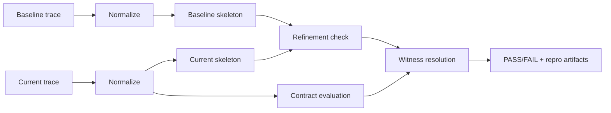

# Trajectly

Deterministic regression testing for AI agents with **Trajectory Refinement Testing (TRT)**.

Trajectly records a baseline run, replays with fixtures, evaluates contracts plus behavioral refinement, and reports the earliest failing trace event (witness index).

## Table of contents

- [1) Quickstart](#1-quickstart)
- [2) Core concepts](#2-core-concepts)
- [3) TRT algorithm](#3-trt-algorithm)
- [4) Daily workflow](#4-daily-workflow)
- [5) CLI reference](#5-cli-reference)
- [6) Spec reference](#6-spec-reference)
- [7) SDK reference](#7-sdk-reference)
- [8) Trace schema reference](#8-trace-schema-reference)
- [9) Contracts reference](#9-contracts-reference)
- [10) Troubleshooting](#10-troubleshooting)

---

## 1) Quickstart

If `trajectly` is not on your `PATH`, run commands as `python -m trajectly ...` using the same interpreter where Trajectly is installed.

### Run a deterministic regression demo

```bash
git clone https://github.com/trajectly/procurement-approval-demo.git
cd procurement-approval-demo
python3.11 -m venv .venv
source .venv/bin/activate
python -m pip install --upgrade pip
python -m pip install -r requirements.txt

python -m trajectly run specs/trt-procurement-agent-regression.agent.yaml --project-root .
python -m trajectly report
python -m trajectly repro
python -m trajectly shrink
```

Expected exit behavior for this intentional regression:
- `run ...regression...` -> `1`
- `report` -> `0`
- `repro` -> `1`
- `shrink` -> `0`

Observed output excerpts from a fresh run (March 5, 2026):

```text
# run ...regression...
- `trt-procurement-agent`: regression
  - trt: `FAIL` (witness=10)

# report
Source: $PROJECT_ROOT/.trajectly/reports/latest.md

# repro
Repro command: python -m trajectly run "$PROJECT_ROOT/specs/trt-procurement-agent-regression.agent.yaml" --project-root "$PROJECT_ROOT"

# shrink
Shrink completed and report updated with shrink stats.
```

Artifacts produced by this flow:
- `$PROJECT_ROOT/.trajectly/reports/latest.md`
- `$PROJECT_ROOT/.trajectly/reports/latest.json`
- `$PROJECT_ROOT/.trajectly/repros/<spec>.json`
- `$PROJECT_ROOT/.trajectly/repros/<spec>.counterexample.reduced.trace.jsonl`

### Record your own baseline

```bash
python -m trajectly init
python -m trajectly record specs/my-agent.agent.yaml --project-root .
python -m trajectly run specs/my-agent.agent.yaml --project-root .
```

`specs/my-agent.agent.yaml` is a placeholder. Replace with an existing spec path.

Observed output cue:

```text
Initialized Trajectly workspace at $PROJECT_ROOT
Recorded 1 spec(s) successfully
- `my-agent`: clean
  - trt: `PASS`
```

---

## 2) Core concepts

### Baseline

A baseline is the known-good behavior for a spec. Trajectly stores baseline traces plus fixtures for deterministic replay.

### Replay

In replay mode, tool and LLM calls are matched against fixtures and returned deterministically. This removes online nondeterminism from regression checks.

### Contracts

Contracts define allowed behavior (tool allow/deny, sequence constraints, budgets, network/data policies, argument rules).

### Refinement

Trajectly extracts ordered tool-call skeletons and verifies baseline skeleton is a subsequence of current skeleton.

### Witness index

When checks fail, Trajectly reports the earliest failing trace event index.

Important:
- witness index is a **trace event index** (0-based)
- trace event index is distinct from violation list ordering in report summaries

---

## 3) TRT algorithm

TRT answers: "Did behavior violate policy or diverge from baseline?" instead of "Did output text change?"


```mermaid
flowchart LR
    Tb["Baseline trace"] --> Nb["Normalize"]
    Tn["Current trace"] --> Nn["Normalize"]
    Nb --> Sb["Baseline skeleton"]
    Nn --> Sn["Current skeleton"]
    Sb --> R["Refinement check"]
    Sn --> R
    Nn --> C["Contract evaluation"]
    R --> W["Witness resolution"]
    C --> W
    W --> V["PASS/FAIL + repro artifacts"]
```

### Stage 1: normalization

Canonicalization removes unstable noise (timestamps, volatile ids, shape differences) so equivalent behavior compares deterministically.

### Stage 2: skeleton extraction

Tool-call sequence is extracted from normalized trace.

### Stage 3: refinement

Baseline skeleton must appear in current skeleton in the same relative order (subsequence relation).

### Stage 4: contracts

Current trace is checked against contracts independently of refinement.

### Witness resolution

If any violation exists, TRT chooses the earliest failing event index as witness.

Practical impact:
- deterministic CI gate
- deterministic repro (`python -m trajectly repro`)
- counterexample minimization (`python -m trajectly shrink`)

---

## 4) Daily workflow

### Setup once

```bash
python -m trajectly init
```

Output cue:

```text
Initialized Trajectly workspace at $PROJECT_ROOT
```

### Record baseline

```bash
python -m trajectly record specs/*.agent.yaml --project-root .
```

Output cue:

```text
Recorded 1 spec(s) successfully
```

### Validate changes

```bash
python -m trajectly run specs/*.agent.yaml --project-root .
python -m trajectly report
```

Output cues:

```text
# clean run
- `my-agent`: clean
  - trt: `PASS`

# regression run
- `my-agent`: regression
  - trt: `FAIL` (witness=...)
Source: $PROJECT_ROOT/.trajectly/reports/latest.md
```

### If failing

```bash
python -m trajectly repro
python -m trajectly shrink
```

Output cues:

```text
Repro command: python -m trajectly run "$PROJECT_ROOT/specs/my-agent.agent.yaml" --project-root "$PROJECT_ROOT"
Shrink completed and report updated with shrink stats.
```

### If change is intentional

```bash
python -m trajectly baseline create --name v2 specs/my-agent.agent.yaml --project-root .
python -m trajectly baseline promote v2 specs/my-agent.agent.yaml --project-root .
```

Output cues:

```text
Created baseline version `v2` for 1 spec(s)
{
  "promoted": ["my-agent"],
  "version": "v2"
}
```

---

## 5) CLI reference

The command surface below reflects current `python -m trajectly --help` output.

Output snippets in this section were captured from fresh runs on March 5, 2026. Paths are normalized to `$PROJECT_ROOT`.

### Top-level commands

| Command | Purpose |
|---|---|
| `python -m trajectly --version` | Print version |
| `python -m trajectly init [PROJECT_ROOT]` | Initialize `.trajectly/` workspace |
| `python -m trajectly enable [PROJECT_ROOT] [--template ...]` | Scaffold and auto-discover setup |
| `python -m trajectly record [TARGETS]... [--auto] [--project-root ...] [--allow-ci-write]` | Record baselines and fixtures |
| `python -m trajectly run TARGETS... [--project-root ...] [--baseline ...] [--strict/--no-strict]` | Run TRT checks |
| `python -m trajectly repro [SELECTOR] [--project-root ...] [--strict/--no-strict] [--print-only]` | Reproduce latest/selected regression |
| `python -m trajectly shrink [SELECTOR] [--project-root ...] [--max-seconds ...] [--max-iterations ...]` | Minimize failing trace |
| `python -m trajectly report [--project-root ...] [--json] [--pr-comment]` | Print latest aggregate report |
| `python -m trajectly baseline ...` | Baseline lifecycle commands |

### `init`

```bash
python -m trajectly init
python -m trajectly init ./my-project
```

Observed output:

```text
Initialized Trajectly workspace at $PROJECT_ROOT
```

### `enable`

```bash
python -m trajectly enable
python -m trajectly enable . --template openai
```

Supported templates include `openai`, `langchain`, and `autogen`.

Observed output (`--template openai`):

```text
Enabled Trajectly workspace at $PROJECT_ROOT
Applied template: openai
Template files created:
- $PROJECT_ROOT/templates/openai_agent.py
- $PROJECT_ROOT/openai.agent.yaml
Next step: python -m trajectly record --auto
```

### `record`

Signature:

```text
python -m trajectly record [TARGETS]... [--project-root PATH] [--auto] [--allow-ci-write]
```

Examples:

```bash
python -m trajectly record specs/my-agent.agent.yaml --project-root .
python -m trajectly record --auto --project-root .
```

Observed output:

```text
Recorded 1 spec(s) successfully
```

### `run`

Signature:

```text
python -m trajectly run TARGETS... [--project-root PATH] [--baseline-dir PATH] [--fixtures-dir PATH] [--baseline VERSION] [--strict/--no-strict]
```

Examples:

```bash
python -m trajectly run specs/my-agent.agent.yaml --project-root .
python -m trajectly run specs/*.agent.yaml --project-root . --baseline v2
```

Exit codes:
- `0` = all passing
- `1` = one or more regressions
- `2` = config/internal/tooling error

Observed output cues:

```text
# pass
- `trt-procurement-agent`: clean
  - trt: `PASS`

# fail
- `trt-procurement-agent`: regression
  - trt: `FAIL` (witness=10)
```

### `repro`

Signature:

```text
python -m trajectly repro [SELECTOR] [--project-root PATH] [--strict/--no-strict] [--print-only]
```

Examples:

```bash
python -m trajectly repro
python -m trajectly repro my-agent
python -m trajectly repro --print-only
```

Observed output:

```text
# --print-only
Repro command: python -m trajectly run "$PROJECT_ROOT/specs/trt-procurement-agent-regression.agent.yaml" --project-root "$PROJECT_ROOT"

# execute repro
- `trt-procurement-agent`: regression
  - trt: `FAIL` (witness=10)
```

### `shrink`

Signature:

```text
python -m trajectly shrink [SELECTOR] [--project-root PATH] [--max-seconds FLOAT] [--max-iterations INT]
```

Examples:

```bash
python -m trajectly shrink
python -m trajectly shrink my-agent --max-seconds 20 --max-iterations 500
```

Observed output:

```text
Shrink completed and report updated with shrink stats.
Latest report: $PROJECT_ROOT/.trajectly/reports/latest.md
```

### `report`

```bash
python -m trajectly report
python -m trajectly report --json
python -m trajectly report --pr-comment
```

Observed output cues:

```text
# report
Source: $PROJECT_ROOT/.trajectly/reports/latest.md

# report --json (excerpt)
"regressions": 1
"trt_failure_class": "REFINEMENT"

# report --pr-comment (excerpt)
### Trajectly Regression Report
- Specs processed: **1**
- Regressions: **1**
```

### Baseline commands

#### `baseline list`

```text
python -m trajectly baseline list [TARGETS]... [--project-root PATH]
```

```bash
python -m trajectly baseline list
python -m trajectly baseline list specs/my-agent.agent.yaml
```

Observed output (excerpt):

```json
{
  "schema_version": "v1",
  "specs": [
    {
      "slug": "trt-procurement-agent",
      "promoted": "v1",
      "versions": ["v1"]
    }
  ]
}
```

#### `baseline create`

```text
python -m trajectly baseline create --name VERSION TARGETS... [--project-root PATH] [--allow-ci-write]
```

`TARGETS...` is required.

```bash
python -m trajectly baseline create --name v2 specs/my-agent.agent.yaml --project-root .
```

Observed output:

```text
Created baseline version `v2` for 1 spec(s)
```

#### `baseline promote`

```text
python -m trajectly baseline promote VERSION [TARGETS]... [--project-root PATH]
```

```bash
python -m trajectly baseline promote v2 specs/my-agent.agent.yaml --project-root .
```

Observed output (excerpt):

```json
{
  "promoted": ["trt-procurement-agent"],
  "version": "v2"
}
```

#### `baseline diff`

```text
python -m trajectly baseline diff SPEC_SLUG LEFT RIGHT [--project-root PATH] [--json]
```

```bash
python -m trajectly baseline diff my-agent v1 v2 --project-root .
python -m trajectly baseline diff my-agent v1 v2 --json
```

Observed output (`--json`, excerpt):

```json
{
  "slug": "trt-procurement-agent",
  "left": "v1",
  "right": "v2",
  "summary": {
    "regression": false,
    "finding_count": 0
  }
}
```

#### `baseline update`

```text
python -m trajectly baseline update [TARGETS]... [--project-root PATH] [--auto] [--allow-ci-write]
```

```bash
python -m trajectly baseline update specs/my-agent.agent.yaml --project-root .
python -m trajectly baseline update --auto --project-root .
```

Observed output:

```text
Updated baseline for 1 spec(s)
```

---

## 6) Spec reference

Trajectly specs are `.agent.yaml` files.

### Minimal example

```yaml
schema_version: "0.4"
name: my-agent
command: python -m agents.my_agent
contracts:
  tools:
    allow: [fetch_data, summarize]
```

Required fields:
- `schema_version`
- `name`
- `command`

### Annotated example (realistic)

```yaml
schema_version: "0.4"
name: procurement-agent
command: python agents/procurement_agent.py
workdir: .
strict: true
fixture_policy: by_hash
env:
  TRAJECTLY_DEMO_USE_OPENAI: "0"
contracts:
  tools:
    allow: [fetch_requisition, fetch_vendor_quotes, route_for_approval, create_purchase_order]
    deny: [unsafe_direct_award]
  sequence:
    require: [tool:fetch_requisition, tool:fetch_vendor_quotes, tool:route_for_approval, tool:create_purchase_order]
    require_before:
      - before: tool:route_for_approval
        after: tool:create_purchase_order
```

Why this pattern is commonly used:
1. `strict: true` prevents silent replay mismatches.
2. `fixture_policy: by_hash` keeps fixture matching deterministic.
3. `contracts.tools` and `contracts.sequence` enforce policy and ordering, not just final text output.

### Common fields

| Field | Purpose |
|---|---|
| `schema_version` | Spec schema version (`0.4`) |
| `name` | Human-readable spec name |
| `command` | Command used by runtime subprocess |
| `workdir` | Optional run working directory |
| `env` | Env overrides |
| `contracts` | Policy constraints |
| `replay` | Replay matching configuration |
| `refinement` | Refinement behavior controls |
| `determinism` | Determinism-related runtime controls |
| `redact` | Regex redaction patterns |
| `budget_thresholds` | Max latency/tool calls/tokens |
| `artifacts_dir` | Artifact output directory |

### Spec inheritance (`extends`)

```yaml
# child.agent.yaml
extends: ./base.agent.yaml
name: my-agent-variant
contracts:
  tools:
    deny: [unsafe_export]
```

Merge semantics:
- dicts merge recursively
- lists and scalars override parent values

---

## 7) SDK reference

Trajectly supports two SDK styles that share the same runtime instrumentation path.

### Choosing an SDK style

1. Use decorators when you already have plain Python functions and want minimal integration work.
2. Use `trajectly.App` when you want explicit DAG structure, node dependencies, and generated spec scaffolding.
3. Both styles emit the same trace event types and use the same CLI/report pipeline.

### A) Decorators

```python
from trajectly.sdk import tool, llm_call

@tool("fetch_ticket")
def fetch_ticket(ticket_id: str) -> dict:
    return {"id": ticket_id}

@llm_call(provider="openai", model="gpt-4o")
def classify_ticket(prompt: str) -> str:
    ...
```

### B) Declarative graph (`trajectly.App`)

```python
import trajectly

app = trajectly.App(name="support-agent")

@app.node(id="fetch_ticket", type="tool")
def fetch_ticket(ticket_id: str) -> dict:
    ...

@app.node(id="classify", type="llm", depends_on=["fetch_ticket"], provider="openai", model="gpt-4o")
def classify(fetch_ticket: dict) -> str:
    ...

@app.node(id="format", type="transform", depends_on=["classify"])
def format_output(classify: str) -> dict:
    return {"answer": classify}

if __name__ == "__main__":
    outputs = app.run(input_data={"ticket_id": "T-123"})
    print(outputs["format"])
```

### Graph API objects

- `trajectly.App`: graph registration and execution
- `trajectly.sdk.graph.NodeSpec`: immutable node definition
- `trajectly.sdk.graph.GraphSpec`: validated graph snapshot (nodes, topological order, input keys)
- `trajectly.sdk.graph.GraphError`: static graph validation errors
- `trajectly.sdk.graph.scan_module(module)`: discover decorated node specs

### `App.node(...)` semantics

Node types:
- `tool`
- `llm`
- `input`
- `transform`

Dependencies:
- `depends_on=["a", "b"]` -> positional parameter mapping
- `depends_on={"param": "source_node"}` -> explicit mapping
- `depends_on=None` -> parameters resolve from `input_data` or previous node ids

### Deterministic order

Graph execution uses deterministic topological ordering (lexicographic tie-break for same indegree).

### Event mapping

Graph execution emits the same event types used everywhere else:
- `tool_called` / `tool_returned` via `ctx.invoke_tool`
- `llm_called` / `llm_returned` via `ctx.invoke_llm`
- `agent_step` markers for graph lifecycle and transform stages

No new event type is introduced for graph mode.

### `generate_spec(...)`

`App.generate_spec()` returns a `.agent.yaml`-compatible dictionary template:
- fills `schema_version`, `name`, placeholder `command`
- derives tool allowlist and sequence requirements from graph tool nodes
- allows deep-merged overrides

### Framework adapters

For framework-native integration, use wrappers from `trajectly.sdk` such as:
- `openai_chat_completion`
- `gemini_generate_content`
- `langchain_invoke`
- `anthropic_messages_create`
- `llamaindex_query`

---

## 8) Trace schema reference

Trajectly stores traces as JSONL (one event per line).

### Event envelope

| Field | Meaning |
|---|---|
| `schema_version` | Trace event schema version (`"v1"`) |
| `event_type` | Event kind |
| `seq` | Emission sequence number |
| `run_id` | Run identifier |
| `rel_ms` | Milliseconds since run start |
| `payload` | Event-specific payload |
| `meta` | Optional metadata |
| `event_id` | Deterministic event hash (if present) |

### Event types

| Event type | Meaning |
|---|---|
| `run_started` | Runtime start marker |
| `agent_step` | Logical step marker |
| `tool_called` | Tool invocation started |
| `tool_returned` | Tool invocation finished |
| `llm_called` | LLM invocation started |
| `llm_returned` | LLM invocation finished |
| `run_finished` | Runtime completion marker |

Example:

```json
{
  "schema_version": "v1",
  "event_type": "tool_called",
  "seq": 6,
  "run_id": "run-01H...",
  "rel_ms": 124,
  "payload": {
    "tool_name": "fetch_data",
    "input": {"args": ["q-123"], "kwargs": {}}
  },
  "meta": {}
}
```

Note: spec schema version (`0.4`) and trace schema version (`v1`) are different artifacts and intentionally use different version namespaces.

---

## 9) Contracts reference

Contracts are under `contracts:` in spec YAML.

Common contract violation signals in reports:

| Contract area | Typical report signal |
|---|---|
| `tools.deny` | `trt_failure_class: CONTRACT` with denied tool violation |
| `sequence.require` / `require_before` | `trt_failure_class: CONTRACT` with missing/ordering violation |
| `network` | `trt_failure_class: CONTRACT` with outbound network policy violation |
| `args` | `trt_failure_class: CONTRACT` with argument schema/regex violation |
| refinement drift (baseline subsequence broken) | `trt_failure_class: REFINEMENT`, often `REFINEMENT_BASELINE_CALL_MISSING` |

### Tools

```yaml
contracts:
  tools:
    allow: [fetch_data, save_result]
    deny: [unsafe_export]
    max_calls_total: 10
    max_calls_per_tool:
      fetch_data: 3
```

### Sequence

```yaml
contracts:
  sequence:
    require: [fetch_data, process, save_result]
    forbid: [unsafe_export]
    require_before:
      - before: fetch_data
        after: save_result
    eventually: [save_result]
    never: [unsafe_export]
    at_most_once: [initialize]
```

### Side effects

```yaml
contracts:
  side_effects:
    deny_write_tools: true
```

### Network

```yaml
contracts:
  network:
    default: deny
    allow_domains: [api.example.com]
```

### Data leak

```yaml
contracts:
  data_leak:
    deny_pii_outbound: true
    outbound_kinds: [TOOL_CALL, LLM_REQUEST]
    secret_patterns: ["(?i)api[_-]?key"]
```

### Arguments

```yaml
contracts:
  args:
    fetch_data:
      required_keys: [query]
      fields:
        query:
          type: string
          regex: "^[a-zA-Z0-9-]+$"
```

---

## 10) Troubleshooting

### Missing fixture / fixture exhausted

Symptoms:
- `Missing fixture for tool call ...`
- `FIXTURE_EXHAUSTED`

Observed output excerpt:

```text
ERROR: Missing fixture for tool call <tool_name>
```

Actions:
1. re-record baseline for the spec
2. verify replay matching settings (`replay.tool_match_mode`, `replay.llm_match_mode`)
3. reduce nondeterministic inputs between record/replay

### Network blocked in replay

Offline replay intentionally blocks live network access by default.

If you explicitly need online mode, set `replay.mode: online` in the spec. Keep offline mode for CI determinism.

### CI baseline writes blocked

When `TRAJECTLY_CI=1`, baseline writes are blocked unless explicitly overridden.

Observed output excerpt:

```text
ERROR: Baseline writes are blocked when TRAJECTLY_CI=1. Re-run `python -m trajectly record ... --allow-ci-write` only for explicit baseline updates.
```

Use:

```bash
python -m trajectly record specs/my-agent.agent.yaml --allow-ci-write
```

or

```bash
python -m trajectly baseline update specs/my-agent.agent.yaml --allow-ci-write
```

### Reporter says FAIL but you need the exact command

Use print-only repro:

```bash
python -m trajectly repro --print-only
```

Observed output:

```text
Repro command: python -m trajectly run "$PROJECT_ROOT/specs/trt-procurement-agent-regression.agent.yaml" --project-root "$PROJECT_ROOT"
```

### Upgrade drift after Trajectly version changes

Re-record baseline versions after upgrades to align fixtures and normalizer behavior:

```bash
python -m trajectly baseline update --auto --project-root .
```

Observed output:

```text
Updated baseline for 1 spec(s)
```

---

## Related repositories

- Support demo: <https://github.com/trajectly/support-escalation-demo>
- Procurement demo: <https://github.com/trajectly/procurement-approval-demo>
