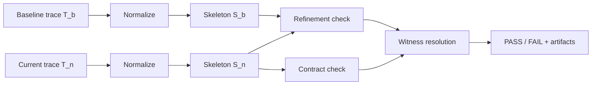

# Trajectly

Deterministic regression testing for AI agents, powered by **Trajectory Refinement Testing (TRT)**.

Trajectly records a known-good agent run as a baseline, then replays your agent against the same inputs when you make changes. The TRT algorithm normalizes traces, extracts call skeletons, enforces contracts, and checks behavioral refinement. If the agent's behavior regresses -- calling a denied tool, skipping required steps, or violating your rules -- Trajectly reports exactly where the failure happened and gives you a one-command repro.

## Table of Contents

- [1) Quickstart](#1-quickstart)
- [2) Core Concepts](#2-core-concepts)
- [3) The TRT Algorithm](#3-the-trt-algorithm)
- [4) How-To Guides](#4-how-to-guides)
- [5) CLI Reference](#5-cli-reference)
- [6) Spec Reference](#6-spec-reference)
- [7) SDK Reference](#7-sdk-reference)
- [8) Trace Schema Reference](#8-trace-schema-reference)
- [9) Contracts Reference](#9-contracts-reference)
- [10) Troubleshooting](#10-troubleshooting)

---

## 1) Quickstart

Get a working regression test in under 5 minutes.

### Install and run

```bash
git clone https://github.com/trajectly/trajectly.git
cd trajectly
pip install -e ".[examples]"
export OPENAI_API_KEY="sk-..."

cd examples
trajectly init
trajectly record specs/trt-support-triage-baseline.agent.yaml
trajectly run specs/trt-support-triage-baseline.agent.yaml
trajectly run specs/trt-support-triage-regression.agent.yaml
```

### What just happened

1. `trajectly init` created a `.trajectly/` directory for state and artifacts.
2. `trajectly record` ran the agent and saved the trace + fixtures as the known-good baseline.
3. `trajectly run` on the baseline spec replayed it and confirmed it still passes.
4. `trajectly run` on the regression spec detected that the agent called a denied tool (`unsafe_export`) and reported `FAIL`.

### Expected output

```text
# Baseline replay
trt-support-triage: PASS

# Regression replay
trt-support-triage: FAIL
  failure_step: 12
  failure_type: contract_tool_denied
  repro: trajectly repro
```

### Reproduce the failure offline

```bash
trajectly repro
```

This replays from saved fixtures -- no live API calls needed.

---

## 2) Core Concepts

### Baselines

A baseline is a recorded agent run that represents correct behavior. Trajectly saves the full trace (every tool call, LLM call, and result) plus the inputs needed to replay it deterministically.

### Specs

A spec (`.agent.yaml` file) tells Trajectly how to run your agent and what rules to check. At minimum, it has a name, a command, and contracts:

```yaml
schema_version: "0.3"
name: trt-support-triage
command: python -m examples.support_triage.main
contracts:
  tools:
    allow: [fetch_ticket, store_triage]
    deny: [unsafe_export]
```

### Contracts (rules)

Contracts define what your agent is and isn't allowed to do:

- **Tool allow/deny**: which tools can be called
- **Sequence constraints**: required ordering of tool calls
- **Budget limits**: max number of tool calls, tokens, or latency
- **Data leak checks**: block PII from leaving the agent
- **Network policies**: restrict outbound network access

### Traces

A trace is the ordered sequence of events from a single agent run: `run_started`, `tool_called`, `tool_returned`, `llm_called`, `llm_returned`, `run_finished`. Trajectly compares the baseline trace against the new trace to find regressions.

### Behavior comparison (TRT)

When you run a spec, the TRT algorithm checks two things:

1. **Contract compliance** -- does the new run follow all the rules in your spec?
2. **Skeleton refinement** -- does the new run's call skeleton preserve the baseline skeleton as a subsequence?

If either check fails, TRT identifies the **witness index** -- the earliest event where a violation occurred -- and reports it.

### Verdicts

Every run produces a deterministic verdict:

- **PASS** -- the agent's behavior refines the baseline and all contracts are satisfied.
- **FAIL** -- something changed. Trajectly reports the failure step (witness index), the violation code, and a repro command.

Same code + same spec + same fixtures = same verdict. Always. This is TRT's determinism guarantee.

### Before vs After Trajectly

| | Without Trajectly | With Trajectly |
|---|---|---|
| Regression detection | Heuristic, output-diff based | Deterministic checks against rules and baseline |
| Failure location | Manual trace reading | Exact step number where the failure occurred |
| Reproducibility | Often not replayable | One-command `trajectly repro` from saved fixtures |
| CI signal | Flaky and subjective | Stable PASS/FAIL with consistent failure codes |

### Where Trajectly fits in CI


---

## 3) The TRT Algorithm

**Trajectory Refinement Testing (TRT)** is the verification algorithm at the core of Trajectly. It turns agent regression testing from "did the output change?" into "did the agent's behavior violate its specification?" -- with formal guarantees.

### Why a new algorithm?

Traditional regression testing for LLM agents is fragile:

- **Output-diff testing** breaks because LLM responses are non-deterministic. The same prompt can produce different wording every time.
- **Snapshot testing** requires exact match, which is too strict for agents that legitimately vary in how they express results.
- **Manual trace inspection** doesn't scale. A single agent run can produce hundreds of events.

TRT solves this by testing *behavior* (what tools were called, in what order, with what policies) rather than *output* (the exact text the LLM produced). This makes tests stable, deterministic, and meaningful.

### The four stages

TRT processes every run through four stages:



#### Stage 1: Trace normalization

Both the baseline trace (`T_b`) and current trace (`T_n`) are run through a normalization function `alpha` that:

- Strips non-deterministic fields (timestamps, run IDs, response latencies)
- Canonicalizes payload formats (sorted keys, stable serialization)
- Computes deterministic event IDs (content hashes)

This produces `alpha(T_b)` and `alpha(T_n)` -- canonical representations that can be compared stably across runs.

**Why this matters:** Two runs of the same agent with the same inputs may produce traces that differ in timestamps, ordering of concurrent events, or formatting. Normalization ensures these irrelevant differences don't cause false failures.

#### Stage 2: Skeleton extraction

From each normalized trace, TRT extracts the **call skeleton** -- the ordered list of tool-call names:

```
Trace: [run_started, llm_called, llm_returned, tool_called:fetch_ticket,
        tool_returned:fetch_ticket, tool_called:store_triage,
        tool_returned:store_triage, run_finished]

Skeleton: [fetch_ticket, store_triage]
```

The skeleton captures *what the agent did* without the noise of *how the LLM reasoned about it*.

#### Stage 3: Refinement check

TRT checks whether the baseline skeleton `S(T_b)` is a **subsequence** of the current skeleton `S(T_n)`.

**Subsequence** means every element of `S(T_b)` appears in `S(T_n)` in the same relative order, but `S(T_n)` may have additional calls interleaved.

```
Baseline skeleton:  [fetch_ticket, store_triage]
Current skeleton:   [fetch_ticket, log_event, store_triage]    ← PASS (extra call is ok)
Current skeleton:   [fetch_ticket, unsafe_export]               ← FAIL (store_triage missing)
Current skeleton:   [store_triage, fetch_ticket]                ← FAIL (wrong order)
```

This is the core behavioral check. It answers: "Does the new agent still do everything the baseline did, in the right order?"

The refinement check is configurable via the `refinement` section of the spec:

| Setting | Effect |
|---------|--------|
| `allow_extra_tools: [log_event]` | Extra calls to `log_event` are ignored |
| `allow_new_tool_names: true` | New tool names not in the baseline are allowed |
| `ignore_call_tools: [debug]` | Calls to `debug` are stripped before comparison |

#### Stage 4: Contract evaluation

Independently from refinement, TRT evaluates every event in the current trace against the spec's **contracts**:

| Contract class | What it checks |
|----------------|----------------|
| **Tool allow/deny** | Is each tool call in the allow list? Is it not in the deny list? |
| **Sequence** | Are required tool sequences present? Are forbidden sequences absent? |
| **Budget** | Are tool call counts, token counts, and latency within limits? |
| **Network** | Are outbound requests to allowed domains only? |
| **Data leak** | Does any outbound payload contain PII or secrets? |
| **Arguments** | Do tool call arguments match required schemas and patterns? |

Each contract violation produces a violation record with:
- **Code** (e.g., `CONTRACT_TOOL_DENIED`, `REFINEMENT_BASELINE_CALL_MISSING`)
- **Event index** where it occurred
- **Message** describing what went wrong
- **Hint** suggesting how to fix it

### Witness resolution

When one or more violations are found, TRT identifies the **witness index** -- the smallest event index `k` such that there exists a violation at `k`. This is the earliest point in the trace where the agent's behavior diverges from what's allowed.

The witness is important because it gives you a precise debugging target: "Look at event `k` in the trace. That's where the problem starts."

```
Events:  [0: run_started, 1: llm_called, 2: llm_returned,
          3: tool_called:fetch_ticket, 4: tool_returned:fetch_ticket,
          5: tool_called:unsafe_export ← WITNESS (denied tool),
          6: tool_returned:unsafe_export, 7: run_finished]

Witness index: 5
Primary violation: CONTRACT_TOOL_DENIED (unsafe_export)
```

### Counterexample generation

Given a witness at index `k`, TRT produces a **counterexample prefix** -- the trace events `[0..k]`. This is the minimal trace that demonstrates the failure. Combined with saved fixtures, this prefix is sufficient to reproduce the failure deterministically:

```bash
trajectly repro
```

TRT can also **shrink** the trace further, iteratively removing events and re-checking whether the failure still reproduces, to find the absolute minimal failing trace:

```bash
trajectly shrink
# "Shrink reduced 42 events → 12 events, same witness"
```

### Formal properties

TRT provides the following guarantees:

**Determinism:** For any spec `P`, trace pair `(T_b, T_n)`, and fixture set `F`:

```
TRT(P, T_b, T_n, F) at time t₁ = TRT(P, T_b, T_n, F) at time t₂
```

The same inputs always produce the same verdict. This is achieved through trace normalization and offline replay (no live network calls during comparison).

**Witness minimality:** If TRT reports a witness at index `k`, there is no index `j < k` with a violation. The witness is always the earliest failing point.

**Refinement soundness:** If TRT reports `PASS` for refinement, then `S(T_b)` is provably a subsequence of `S(T_n)`. If it reports `FAIL`, TRT identifies the specific baseline call that is missing and where the subsequence embedding breaks.

**Contract completeness:** Every event in the current trace is checked against every active contract. No events are skipped unless explicitly configured in `ignore_call_tools`.

### Putting it together: a concrete example

Suppose you have a support triage agent with this spec:

```yaml
contracts:
  tools:
    allow: [fetch_ticket, store_triage]
    deny: [unsafe_export]
```

**Baseline run** produces skeleton: `[fetch_ticket, store_triage]`

**Regression run** produces skeleton: `[fetch_ticket, unsafe_export]`

TRT processes this as follows:

1. **Normalize** both traces → strips timestamps, computes event hashes.
2. **Extract skeletons** → `S_b = [fetch_ticket, store_triage]`, `S_n = [fetch_ticket, unsafe_export]`.
3. **Refinement check** → is `[fetch_ticket, store_triage]` a subsequence of `[fetch_ticket, unsafe_export]`? **No** -- `store_triage` is missing. Violation: `REFINEMENT_BASELINE_CALL_MISSING`.
4. **Contract check** → is `unsafe_export` in the deny list? **Yes**. Violation: `CONTRACT_TOOL_DENIED`.
5. **Witness resolution** → both violations occur at the event where `unsafe_export` is called (index 5 in the full trace). Witness = 5.
6. **Verdict** → `FAIL`, witness=5, primary violation=`CONTRACT_TOOL_DENIED`, repro command=`trajectly repro`.

---

## 4) How-To Guides

### Add Trajectly to an existing agent

1. Install: `pip install trajectly`

2. Instrument your agent code with the SDK:

```python
from trajectly.sdk import tool, openai_chat_completion

@tool()
def fetch_data(query: str) -> dict:
    # your tool logic
    ...

# For LLM calls, use the appropriate adapter:
result = openai_chat_completion(client, model="gpt-4o", messages=messages)
```

3. Create a spec file (`my-agent.agent.yaml`):

```yaml
schema_version: "0.3"
name: my-agent
command: python my_agent.py
contracts:
  tools:
    allow: [fetch_data, save_result]
    deny: [dangerous_tool]
```

4. Initialize, record, and test:

```bash
trajectly init
trajectly record my-agent.agent.yaml
trajectly run my-agent.agent.yaml
```

### Write your first spec

Start minimal and add rules as needed:

```yaml
# Minimal -- just track tool calls
schema_version: "0.3"
name: my-agent
command: python my_agent.py
contracts:
  tools:
    allow: [fetch_data, save_result]
```

Add sequence constraints if order matters:

```yaml
contracts:
  tools:
    allow: [fetch_data, process, save_result]
  sequence:
    require: [fetch_data, process, save_result]
```

Add budget limits for cost control:

```yaml
budget_thresholds:
  max_tool_calls: 10
  max_tokens: 1000
  max_latency_ms: 5000
```

### Set up CI

Add Trajectly to your CI pipeline:

```yaml
# .github/workflows/agent-tests.yml
- name: Run agent regression tests
  run: |
    pip install trajectly
    trajectly run specs/*.agent.yaml
```

Exit codes: `0` = all passing, `1` = regression detected, `2` = config/tooling error.

For PR comments:

```bash
trajectly report --pr-comment
```

### Debug a failure

When a run fails:

1. **Read the report**: `trajectly report` shows the failure step and failure type.
2. **Reproduce locally**: `trajectly repro` replays the exact failure from fixtures.
3. **Minimize the trace**: `trajectly shrink` reduces the failing trace to the smallest example that still fails.
4. **Decide what to do**:
   - If the behavior change is a bug: fix your agent code and rerun.
   - If the behavior change is intentional: update the baseline with `trajectly baseline update`.


---

## 5) CLI Reference

### Command overview

| Command | What it does |
|---|---|
| `trajectly --version` | Print version and exit |
| `trajectly init` | Create `.trajectly/` workspace |
| `trajectly enable` | Set up with scaffolding and auto-discovery |
| `trajectly record` | Record baseline traces and fixtures |
| `trajectly run` | Run specs and report regressions |
| `trajectly repro` | Reproduce the latest failure from fixtures |
| `trajectly shrink` | Minimize a failing trace |
| `trajectly report` | Print the latest report |
| `trajectly baseline update` | Re-record baselines for intentional changes |
| `trajectly migrate spec` | Convert legacy specs to v0.3 format |

### `trajectly --version`

Print the installed version and exit.

```bash
trajectly --version
# trajectly 0.3.0rc3
```

### `trajectly init [project_root]`

Create `.trajectly/` workspace directories.

```bash
trajectly init
trajectly init ./my-project
```

### `trajectly enable [project_root] [--template TEMPLATE]`

Set up Trajectly in an existing project. Optionally apply a starter template (`openai`).

```bash
trajectly enable
trajectly enable . --template openai
```

### `trajectly record [targets...] [--project-root PATH] [--auto] [--allow-ci-write]`

Record baseline traces and fixture bundles.

```bash
# Record a specific spec
trajectly record specs/my-agent-baseline.agent.yaml

# Auto-discover and record all specs
trajectly record --auto
```

### `trajectly run <targets...> [--project-root PATH] [--baseline-dir PATH] [--fixtures-dir PATH] [--strict|--no-strict]`

Run specs against recorded baselines and report regressions.

```bash
# Run one spec
trajectly run specs/my-agent-baseline.agent.yaml

# Run all specs (CI gate)
trajectly run specs/*.agent.yaml

# Override strict mode
trajectly run specs/my-agent.agent.yaml --strict
```

### `trajectly repro [selector] [--project-root PATH] [--strict|--no-strict] [--print-only]`

Reproduce the latest failure offline from saved fixtures.

```bash
# Reproduce most recent failure
trajectly repro

# Reproduce a specific spec's failure
trajectly repro my-agent-name

# Just print the command without running
trajectly repro --print-only
```

### `trajectly shrink [selector] [--max-seconds N] [--max-iterations N]`

Minimize a failing trace to the smallest example that still fails.

```bash
trajectly shrink
trajectly shrink my-agent-name --max-seconds 20
```

### `trajectly report [--project-root PATH] [--json] [--pr-comment]`

Print the latest aggregate report.

```bash
trajectly report              # Markdown
trajectly report --json       # JSON
trajectly report --pr-comment # PR-ready markdown
```

### `trajectly baseline update [targets...] [--auto] [--allow-ci-write]`

Re-record baselines when behavior changes are intentional.

```bash
trajectly baseline update specs/my-agent-baseline.agent.yaml
trajectly baseline update --auto
```

### `trajectly migrate spec <spec_path> [--output PATH] [--in-place]`

Convert a legacy spec to v0.3 format.

```bash
trajectly migrate spec old.agent.yaml --output new.agent.yaml
trajectly migrate spec old.agent.yaml --in-place
```

### Exit codes

- `0`: success / no regression
- `1`: regression detected
- `2`: config, spec, or tooling error

### Common workflows

**First-time setup:**

```bash
trajectly init
trajectly record specs/my-agent-baseline.agent.yaml
trajectly run specs/my-agent-baseline.agent.yaml
```

**CI regression gate:**

```bash
trajectly run specs/*.agent.yaml
```

**Failure triage:**

```bash
trajectly report
trajectly repro
trajectly shrink
```

**Intentional behavior update:**

```bash
trajectly baseline update specs/my-agent-baseline.agent.yaml
trajectly run specs/my-agent-baseline.agent.yaml
```

---

## 6) Spec Reference (`.agent.yaml`, v0.3)

### Minimal spec

```yaml
schema_version: "0.3"
name: my-agent
command: python my_agent.py
contracts:
  tools:
    allow: [tool_a, tool_b]
    deny: [dangerous_tool]
```

Required fields: `schema_version`, `name`, `command`.

### Full spec with all options

```yaml
schema_version: "0.3"
name: my-agent
command: python my_agent.py

workdir: ..
env:
  APP_ENV: ci

fixture_policy: by_hash
strict: true

replay:
  mode: offline
  strict_sequence: true
  llm_match_mode: signature_match
  tool_match_mode: args_signature_match
  fixture_policy: by_hash

refinement:
  mode: skeleton
  allow_extra_llm_steps: true
  allow_extra_tools: [log_event]
  allow_extra_side_effect_tools: []
  allow_new_tool_names: false
  ignore_call_tools: [log_event]

contracts:
  tools:
    allow: [fetch_data, process, save_result]
    deny: [dangerous_tool]
  sequence:
    require: [fetch_data, process, save_result]
  data_leak:
    deny_pii_outbound: true
    outbound_kinds: [TOOL_CALL, LLM_REQUEST]

redact:
  - "(?i)authorization:\\s*bearer\\s+[A-Za-z0-9._-]+"

budget_thresholds:
  max_latency_ms: 10000
  max_tool_calls: 8
  max_tokens: 800

mode_profile: ci_safe
artifacts:
  dir: .trajectly/artifacts
```

### Field reference

**Core fields:**

| Field | Description |
|---|---|
| `schema_version` | `"0.3"` or `"v0.3"` |
| `name` | Stable identifier used in reports |
| `command` | Shell command to run the agent |

**Runtime fields:**

| Field | Description |
|---|---|
| `workdir` | Working directory for the command |
| `env` | Environment variables to inject |

**Replay fields:**

| Field | Description |
|---|---|
| `fixture_policy` | `by_hash` or `by_index` |
| `strict` | Enable strict replay mode |
| `replay.mode` | `offline` (no network) or `online` |
| `replay.strict_sequence` | Require exact event ordering |
| `replay.llm_match_mode` | `signature_match` or `sequence_match` |
| `replay.tool_match_mode` | `args_signature_match` or `sequence_match` |

**Behavior comparison fields:**

| Field | Description |
|---|---|
| `refinement.mode` | `none`, `skeleton`, or `strict` |
| `refinement.allow_extra_llm_steps` | Allow extra LLM calls beyond baseline |
| `refinement.allow_extra_tools` | Tool names allowed beyond baseline |
| `refinement.allow_extra_side_effect_tools` | Side-effect tools allowed beyond baseline |
| `refinement.allow_new_tool_names` | Allow tool names not in baseline |
| `refinement.ignore_call_tools` | Tools excluded from comparison |

**Contract fields:**

| Field | Description |
|---|---|
| `contracts.tools` | Allow/deny lists and per-tool budgets |
| `contracts.sequence` | Required ordering constraints |
| `contracts.side_effects` | Write-guard policies |
| `contracts.network` | Domain allowlist/denylist |
| `contracts.data_leak` | PII/secret leak detection |
| `contracts.args` | Argument schema/regex checks |

**Other fields:**

| Field | Description |
|---|---|
| `redact` | Regex patterns to redact from traces |
| `budget_thresholds` | Latency, tool call, and token limits |
| `mode_profile` | `ci_safe`, `permissive`, or `strict` |
| `artifacts.dir` | Custom artifact output directory |

---

## 7) SDK Reference

The SDK instruments your agent code so Trajectly can record and replay traces.

### Decorators

**`@tool(name=None)`** -- wrap a tool function to record `tool_called` / `tool_returned` events:

```python
from trajectly.sdk import tool

@tool()
def fetch_ticket(ticket_id: str) -> dict:
    return {"id": ticket_id, "status": "open"}

@tool("custom_name")
def my_function():
    ...
```

**`@llm_call(provider, model)`** -- wrap a function that calls an LLM:

```python
from trajectly.sdk import llm_call

@llm_call(provider="openai", model="gpt-4o")
def ask_llm(prompt: str) -> str:
    ...
```

### Framework adapters

Use these instead of decorators when integrating with a specific framework:

```python
from trajectly.sdk import openai_chat_completion

# OpenAI
result = openai_chat_completion(client, model="gpt-4o", messages=messages)
```

Available adapters:

| Adapter | Function |
|---|---|
| OpenAI | `openai_chat_completion(client, model, messages, ...)` |
| Gemini | Use `invoke_llm_call("gemini", model, call_fn, ...)` (see low-level helpers) |

### Low-level helpers

For cases where decorators or adapters don't fit:

```python
from trajectly.sdk import invoke_tool_call, invoke_llm_call, agent_step

# Record a tool call manually
result = invoke_tool_call("tool_name", my_function, arg1, arg2)

# Record an LLM call manually
result = invoke_llm_call("openai", "gpt-4o", my_llm_function, prompt)

# Mark a logical agent step
agent_step("processing_input", details={"key": "value"})
```

### Examples

| Adapter | Example |
|---|---|
| OpenAI | [Ticket Classifier](tutorial-support-triage.md) |
| Gemini | [Code Review Bot](tutorial-code-review-bot.md) |

---

## 8) Trace Schema Reference

Traces are stored as JSONL files (one JSON event per line).

### Event envelope

Every event has these fields:

| Field | Description |
|---|---|
| `schema_version` | Always `"v1"` |
| `event_type` | Event kind (see below) |
| `seq` | Sequence number in emission order |
| `run_id` | Unique run identifier |
| `rel_ms` | Milliseconds since run start |
| `payload` | Event-specific data |
| `meta` | Optional metadata |
| `event_id` | Deterministic hash (added during normalization) |

### Event types

| Type | When it fires |
|---|---|
| `run_started` | Run begins |
| `agent_step` | Logical step marker |
| `llm_called` | Before LLM invocation |
| `llm_returned` | After LLM response |
| `tool_called` | Before tool invocation |
| `tool_returned` | After tool result |
| `run_finished` | Run complete |

### Example events

```json
{
  "schema_version": "v1",
  "event_type": "tool_called",
  "seq": 6,
  "run_id": "run-01JXYZ",
  "rel_ms": 124,
  "payload": {
    "tool_name": "fetch_data",
    "input": { "args": ["query-123"], "kwargs": {} }
  }
}
```

```json
{
  "schema_version": "v1",
  "event_type": "llm_called",
  "seq": 8,
  "run_id": "run-01JXYZ",
  "rel_ms": 200,
  "payload": {
    "provider": "openai",
    "model": "gpt-4o",
    "prompt": "Analyze this data..."
  }
}
```

---

## 9) Contracts Reference

Contracts define the rules your agent must follow. They are specified in the `contracts` section of your spec.

### Tool contracts

Control which tools are allowed and denied:

```yaml
contracts:
  tools:
    allow: [fetch_data, save_result]
    deny: [dangerous_tool]
    max_calls_total: 10
    max_calls_per_tool:
      fetch_data: 3
```

### Sequence contracts

Require specific ordering of tool calls:

```yaml
contracts:
  sequence:
    require: [fetch_data, process, save_result]
    forbid: [bad_sequence_a, bad_sequence_b]
    require_before: [setup_step]
    eventually: [cleanup_step]
    never: [forbidden_step]
    at_most_once: [init_step]
```

### Side-effect contracts

Guard against unintended writes:

```yaml
contracts:
  side_effects:
    deny_write_tools: true
```

### Network contracts

Restrict outbound network access:

```yaml
contracts:
  network:
    default: deny
    allowlist: []
    allow_domains: [api.example.com]
```

### Data leak contracts

Block PII and secrets from leaving the agent:

```yaml
contracts:
  data_leak:
    deny_pii_outbound: true
    outbound_kinds: [TOOL_CALL, LLM_REQUEST]
```

### Argument contracts

Validate tool call arguments:

```yaml
contracts:
  args:
    fetch_data:
      required_keys: [query]
      fields:
        query:
          type: string
          regex: "^[a-zA-Z0-9-]+$"
```

### Failure codes

When a contract is violated, Trajectly reports a failure code like `contract_tool_denied`, `contract_sequence_violated`, etc. The report includes the exact step number and a description of what went wrong.

---

## 10) Troubleshooting

### "FIXTURE_EXHAUSTED" error

**What it means:** The replay needed more fixture data than was recorded.

**How to fix:**

1. Re-record the baseline: `trajectly record your-spec.agent.yaml`
2. Check that your agent isn't making non-deterministic calls that change between runs
3. Verify the matcher mode in your spec (`args_signature_match` vs `signature_match`)

### "NORMALIZER_VERSION_MISMATCH" error

**What it means:** The baseline was recorded with a different version of Trajectly.

**How to fix:**

1. Re-record baselines: `trajectly record --auto`
2. Pin the same Trajectly version in local dev and CI

### Network blocked during replay

**What it means:** Offline replay mode blocks all network access to ensure determinism.

**How to fix:**

1. This is expected behavior. Rely on fixtures for deterministic replay (recommended).
2. If you need network access, set `replay.mode: online` in your spec (not recommended for CI).

### Baseline writes blocked in CI

**What it means:** `TRAJECTLY_CI=1` prevents accidental baseline overwrites in CI.

**How to fix:**

1. Don't update baselines in standard CI runs.
2. For intentional updates, use: `trajectly record --allow-ci-write`

### Shrink didn't reduce the trace

**What it means:** No smaller trace could reproduce the same failure within the configured limits.

**How to fix:**

1. Increase limits: `trajectly shrink --max-seconds 30 --max-iterations 500`
2. The original failing trace is still valid for debugging.

### Common mistakes

| Mistake | Fix |
|---|---|
| Forgetting to `trajectly init` first | Run `trajectly init` before record/run |
| Recording with wrong API key | Set your provider API key before `trajectly record` |
| Running regression spec without recording baseline first | Always `trajectly record` the baseline spec before running regression specs |
| Baseline drift after Trajectly upgrade | Re-record baselines after upgrading: `trajectly record --auto` |
