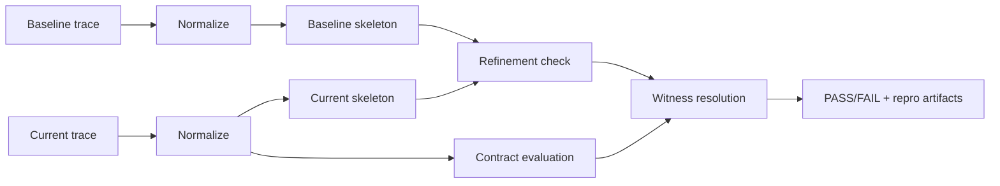

# Trajectly Guide

Deterministic regression testing for AI agents with **Trajectory Refinement Testing (TRT)**.

This guide is the canonical onboarding and operations flow:
- first run
- core concepts
- TRT model
- day-to-day workflow
- troubleshooting

For command and schema lookup, use [Reference](trajectly_reference.md).

## Table of contents

- [1) Quickstart](#1-quickstart)
- [2) Core concepts](#2-core-concepts)
- [3) TRT algorithm](#3-trt-algorithm)
- [4) Daily workflow](#4-daily-workflow)
- [10) Troubleshooting](#10-troubleshooting)

---

## 1) Quickstart

If `trajectly` is not on your `PATH`, run commands as `python -m trajectly ...` using the same interpreter where Trajectly is installed.

### Run a deterministic regression demo

```bash
git clone https://github.com/trajectly/trajectly-survival-arena.git
cd trajectly-survival-arena
python3.11 -m venv .venv
source .venv/bin/activate
python -m pip install --upgrade pip
python -m pip install -r requirements.txt
python -m trajectly init

# baseline behavior (expected PASS)
python -m trajectly run specs/challenges/procurement-chaos.agent.yaml --project-root .

# intentional regression behavior (expected FAIL)
python -m trajectly run specs/examples/procurement-chaos-regression.agent.yaml --project-root .
python -m trajectly report
python -m trajectly repro
python -m trajectly shrink
```

Expected exit behavior for this intentional regression:
- safe `run` -> `0`
- unsafe `run` -> `1`
- `report` -> `0`
- `repro` -> `1`
- `shrink` -> `0`

Output cues:

```text
# safe run
- `procurement-chaos`: clean
  - trt: `PASS`

# regression run
- `procurement-chaos`: regression
  - trt: `FAIL` (witness=...)

# report
Source: $PROJECT_ROOT/.trajectly/reports/latest.md

# repro
Repro command: python -m trajectly run "$PROJECT_ROOT/specs/examples/procurement-chaos-regression.agent.yaml" --project-root "$PROJECT_ROOT"

# shrink
Shrink completed and report updated with shrink stats.
```

Artifacts produced by this flow:
- `$PROJECT_ROOT/.trajectly/reports/latest.md`
- `$PROJECT_ROOT/.trajectly/reports/latest.json`
- `$PROJECT_ROOT/.trajectly/repros/<spec>.json`
- `$PROJECT_ROOT/.trajectly/repros/<spec>.counterexample.reduced.trace.jsonl`

### Record your own baseline

```bash
python -m trajectly init
python -m trajectly record specs/challenges/procurement-chaos.agent.yaml --project-root .
python -m trajectly run specs/challenges/procurement-chaos.agent.yaml --project-root .
```

Replace `specs/challenges/procurement-chaos.agent.yaml` with your own spec path in your project.

---

## 2) Core concepts

### Baseline

A baseline is the known-good behavior for a spec. Trajectly stores baseline traces plus fixtures for deterministic replay.

Baselines are explicit, versioned behavior decisions. Future runs compare against this decision.

### Replay

In replay mode, tool and LLM calls are matched against fixtures and returned deterministically. This removes online nondeterminism from regression checks.

### Contracts

Contracts define allowed behavior (tool allow/deny, sequence constraints, budgets, network/data policies, argument rules).

Arena examples:
- `secret-karaoke` for `data_leak`
- `network-no-fly-zone` for `contracts.network`
- `graph-chain-reaction` for `contracts.args`

### Refinement

Trajectly extracts ordered tool-call skeletons and verifies baseline skeleton is a subsequence of current skeleton.

This catches behavioral drift even when final output text still looks acceptable.

### Witness index

When checks fail, Trajectly reports the earliest failing trace event index.

Important:
- witness index is a **trace event index** (0-based)
- trace event index is distinct from violation list ordering in summary output

---

## 3) TRT algorithm

TRT answers: "Did behavior violate policy or diverge from baseline?" instead of "Did output text change?"



### Stage 1: normalization

Canonicalization removes unstable noise (timestamps, volatile ids, shape differences) so equivalent behavior compares deterministically.

### Stage 2: skeleton extraction

Tool-call sequence is extracted from normalized trace.

### Stage 3: refinement

Baseline skeleton must appear in current skeleton in the same relative order (subsequence relation).

### Stage 4: contracts

Current trace is checked against contracts independently of refinement.

### Witness resolution

If any violation exists, TRT chooses the earliest failing event index as witness.

Practical impact:
- deterministic CI gate
- deterministic repro (`python -m trajectly repro`)
- counterexample minimization (`python -m trajectly shrink`)

---

## 4) Daily workflow

### Setup once

Initialize `.trajectly/` at project root.

```bash
python -m trajectly init
```

### Record baseline

Record from known-good behavior:

```bash
python -m trajectly record specs/challenges/procurement-chaos.agent.yaml --project-root .
```

### Validate changes

Run gate + report:

```bash
python -m trajectly run specs/challenges/*.agent.yaml --project-root .
python -m trajectly report
```

Single-spec iteration example:

```bash
python -m trajectly run specs/challenges/network-no-fly-zone.agent.yaml --project-root .
python -m trajectly report --json
```

### If failing

Use repro first, then shrink:

```bash
python -m trajectly repro
python -m trajectly shrink
```

### If change is intentional

Version and promote baseline explicitly:

```bash
python -m trajectly baseline create --name v2 specs/challenges/procurement-chaos.agent.yaml --project-root .
python -m trajectly baseline promote v2 specs/challenges/procurement-chaos.agent.yaml --project-root .
```

---

## 10) Troubleshooting

Most failures fall into three buckets:
- fixture/replay mismatch
- policy/configuration blocks
- intentional behavior drift requiring baseline management

### Missing fixture / fixture exhausted

Symptoms:
- `Missing fixture for tool call ...`
- `FIXTURE_EXHAUSTED`

Actions:
1. Re-record baseline for the spec.
2. Verify replay matching settings (`replay.tool_match_mode`, `replay.llm_match_mode`).
3. Reduce nondeterministic inputs between record and replay.

### Network blocked in replay

Offline replay intentionally blocks live network by default.

If you explicitly need online mode, set `replay.mode: online` in the spec. Keep offline mode for CI determinism.

### CI baseline writes blocked

When `TRAJECTLY_CI=1`, baseline writes are blocked unless explicitly overridden:

```bash
python -m trajectly record specs/challenges/procurement-chaos.agent.yaml --allow-ci-write
```

or

```bash
python -m trajectly baseline update specs/challenges/procurement-chaos.agent.yaml --allow-ci-write
```

### Reporter says FAIL but you need the exact command

```bash
python -m trajectly repro --print-only
```

### Upgrade drift after Trajectly version changes

```bash
python -m trajectly baseline update --auto --project-root .
```
