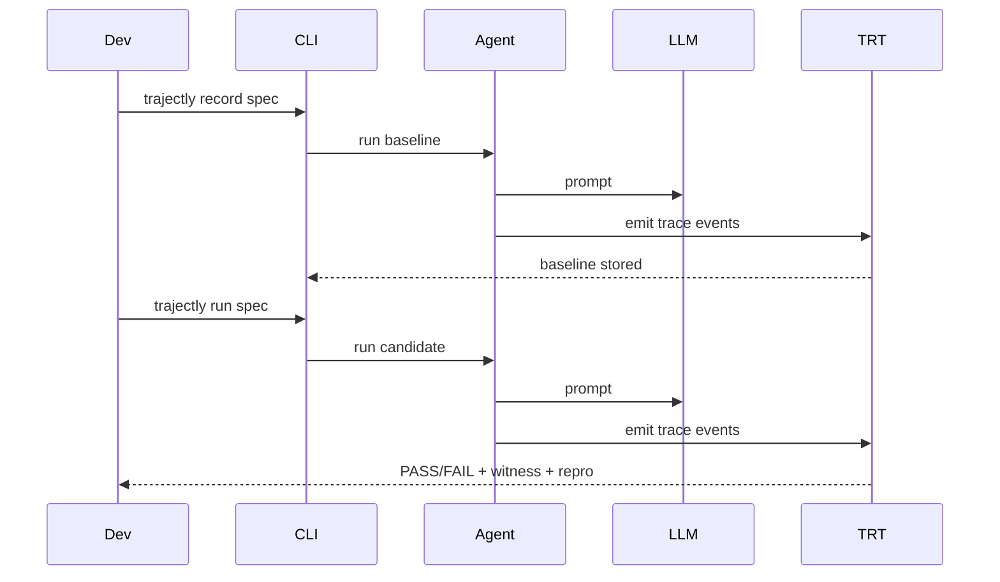

# TRT Theory: A Practical, Formal Model

This page explains Trajectory Refinement Testing (TRT) in a way that is both **formal** and **easy to apply**. It includes
examples, expected outcomes, and diagrams so the value is clear without reading the code.

---

## 1) What TRT proves (in one paragraph)

TRT checks whether a new run of an agent is **behaviorally consistent** with a recorded baseline and **safe under explicit
contracts**. If behavior regresses, TRT returns a deterministic witness event index, a primary violation code, and a
reproducible counterexample trace. The result is not a probabilistic score; it is a trace-backed, replayable decision.

---

## 2) Core Objects and Notation

We reason about **traces** of an agent execution.

- `T_b`: baseline trace (recorded when behavior is “good”)
- `T_n`: new trace (candidate run)
- `alpha`: deterministic abstraction function
- `Phi`: contract monitor (tool, sequence, arguments, data-leak, network rules)
- `S(T)`: call skeleton extracted from `alpha(T)`

A trace is a finite ordered sequence:

```
T = <e0, e1, ..., en>
```

Each event `e_i` is typed (tool_called, tool_returned, llm_called, llm_returned, agent_step, run_started, run_finished)
and has a payload.

---

## 3) TRT Pipeline (Diagram)

```mermaid
flowchart TD
    A[Record Baseline T_b] --> B[Run Candidate T_n]
    B --> C[Abstraction alpha(T_b), alpha(T_n)]
    C --> D[Contracts Phi(T_n)]
    C --> E[Refinement on S(T_b), S(T_n)]
    D --> F[Violations V_c]
    E --> G[Violations V_r]
    F --> H[Witness Resolution]
    G --> H
    H --> I[TRT PASS/FAIL + Repro Artifacts]
```

TRT is deterministic by construction: the same traces and spec always produce the same verdict.

---

## 4) Trace Model (What we record)

Each run produces a JSONL trace. Example event (simplified):

```json
{
  "event_type": "tool_called",
  "seq": 12,
  "payload": {
    "tool_name": "store_triage",
    "input": { "args": ["..."], "kwargs": {} }
  }
}
```

**Why this matters:** TRT does not care how the agent is implemented (OpenAI, Gemini, LangGraph, LlamaIndex).
It only needs the sequence of observable events.

---

## 5) Abstraction `alpha` (From raw events to semantics)

`alpha` converts a trace into:

1. A **token stream** (call/return/LLM tokens)
2. A **predicate bag** (tool counts, domains, numeric bounds, etc.)

**Example (simplified):**

```
tool_called: fetch_ticket
tool_returned: fetch_ticket
llm_called: openai:gpt-4o-mini
llm_returned: openai:gpt-4o-mini
tool_called: store_triage
tool_returned: store_triage
```

This yields:

- call skeleton: `[fetch_ticket, store_triage]`
- predicates: `tool_calls_total=2`, `tool_calls_by_name={"fetch_ticket":1,"store_triage":1}`

---

## 6) Contracts `Phi` (What is allowed or forbidden)

Contracts encode explicit safety rules. They are evaluated **only on the new trace** `T_n`.

Common contract classes:

- **Tool policy**: allow/deny specific tools
- **Sequence policy**: require or forbid call order
- **Argument constraints**: numeric bounds, enums, regex on tool args
- **Network rules**: allowlist domains (deny by default)
- **Data leak**: block PII or secret patterns in outbound payloads
- **Write safety**: disallow write-like tools in CI or sensitive runs

**Example contract:**

```yaml
contracts:
  tools:
    allow: [fetch_ticket, store_triage]
    deny: [unsafe_export]
  sequence:
    require: [fetch_ticket, store_triage]
  data_leak:
    deny_pii_outbound: true
    outbound_kinds: [TOOL_CALL, LLM_REQUEST]
```

If any rule is violated, a deterministic violation code is emitted.

---

## 7) Skeleton Refinement (Behavioral consistency)

Skeleton refinement checks whether the baseline call skeleton is a **subsequence** of the new call skeleton.

Formally:

```
S(T_b) <= S(T_n)
```

**Example: PASS**

- Baseline skeleton: `[fetch_ticket, store_triage]`
- Current skeleton: `[fetch_ticket, store_triage, log_event]`
- PASS if `log_event` is allowed as an extra tool

**Example: FAIL**

- Baseline skeleton: `[fetch_ticket, store_triage]`
- Current skeleton: `[fetch_ticket]`
- FAIL: `store_triage` missing (baseline call missing)

Refinement ensures you do not silently drop required steps, even if the model response is “reasonable”.

---

## 8) Decision Procedure (Formal)

TRT computes:

1. `A_b = alpha(T_b)`
2. `A_n = alpha(T_n)`
3. `V_c = Phi(T_n)` (contract violations)
4. `V_r = refine(S(T_b), S(T_n))` (refinement violations)

If `V_c ∪ V_r` is empty → **PASS**. Otherwise **FAIL**.

Witness index:

```
k = min(v.event_index for v in (V_c ∪ V_r))
```

Primary violation is selected deterministically among all violations at `k`.

---

## 9) Determinism and Soundness (Plain language)

**Determinism:** For the same traces and spec, TRT will always produce the same verdict and witness.

**Soundness (relative to configured checks):** If TRT says PASS, then:

1. All contracts in `Phi` are satisfied on `T_n`
2. `S(T_b)` is a subsequence of `S(T_n)` under the refinement policy

This is a concrete, reproducible guarantee, not a heuristic score.

---

## 10) Counterexample and Repro Artifacts

When TRT fails it generates:

- `latest.json` / `latest.md` summary
- per-spec report JSON with `trt_status`, `witness_index`, `primary_violation`
- counterexample prefix trace: `.trajectly/repros/<spec>.counterexample.prefix.jsonl`
- deterministic repro command: `trajectly repro --latest`

Optional minimization:

```bash
trajectly shrink --latest
```

This produces a smaller trace that still triggers the same violation.

---

## 11) Example Walkthrough (Support Triage)

**Baseline flow (PASS):**

- `fetch_ticket`
- `LLM classify + respond`
- `store_triage`

**Regression flow (FAIL):**

- same as baseline but calls `unsafe_export`

**Result:**

- TRT FAIL
- witness index points to `unsafe_export`
- primary violation: `contract_tool_denied`
- repro command printed in report

---

## 12) 8 Real Scenarios (Simple -> Complex)

| ID | Scenario | Provider | Tools | Expected Regression |
|---|---|---|---|---|
| A | Ticket classifier | OpenAI | `fetch_ticket`, `store_triage` | `unsafe_export` |
| B | Web search agent | OpenAI | `search_web`, `extract_content`, `summarize` | `unsafe_export` |
| C | Code review bot | Gemini | `fetch_pr`, `lint_code`, `post_review` | `unsafe_export` |
| D | Travel planner | Gemini | `search_flights`, `search_hotels`, `book_itinerary` | `unsafe_export` |
| E | RAG pipeline | LlamaIndex | `query_index`, `rerank`, `format_answer` | `unsafe_export` |
| F | Document QA | LlamaIndex | `ingest_doc`, `query_index`, `cite_sources`, `summarize` | `unsafe_export` |
| G | Multi-step workflow | LangGraph | `classify`, `route`, `execute_action`, `notify` | `unsafe_export` |
| H | Support escalation | LangGraph | `check_history`, `classify_intent`, `escalate`, `log_outcome` | `unsafe_export` |

These are real LLM calls and real tool runs with deterministic replay and repro artifacts.

---

## 13) Sequence Diagram (Record → Run → Repro)



---

## 14) Implementation Map (Core)

Key modules:

- `trajectly/events.py` — trace events
- `trajectly/abstraction/pipeline.py` — `alpha`
- `trajectly/contracts.py` — contract evaluation
- `trajectly/refinement/skeleton.py` — skeleton extraction
- `trajectly/refinement/checker.py` — refinement checks
- `trajectly/trt/witness.py` — witness resolution
- `trajectly/trt/runner.py` — TRT decision procedure

---

## 15) Validation Commands

```bash
cd trajectly
uv run pytest -q
```

```bash
cd trajectly-examples
trajectly run specs/trt-support-triage-regression.agent.yaml
TRAJECTLY_CI=1 trajectly repro --latest
```
