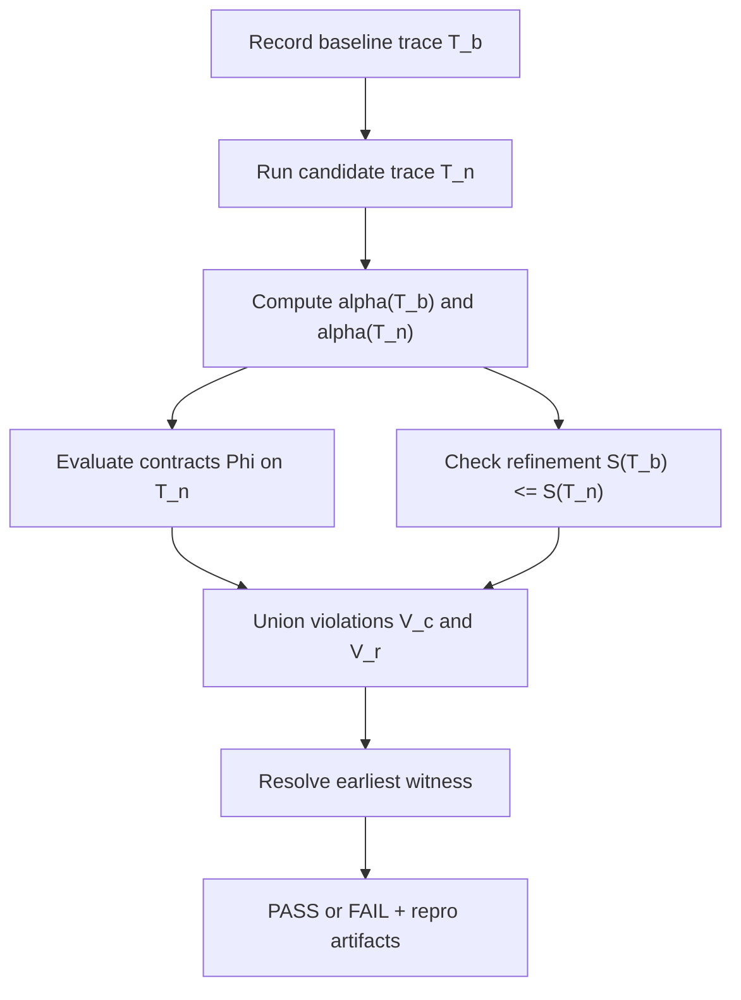
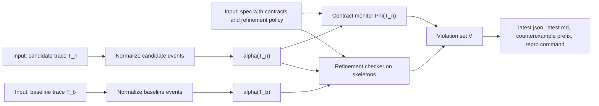
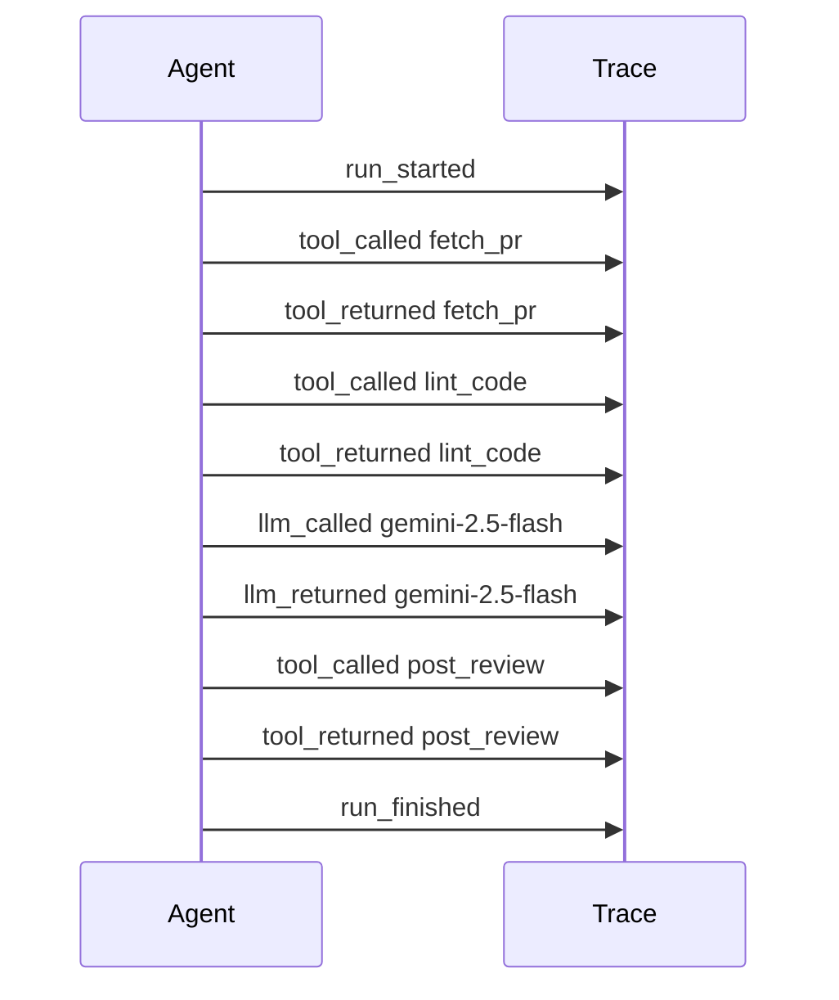
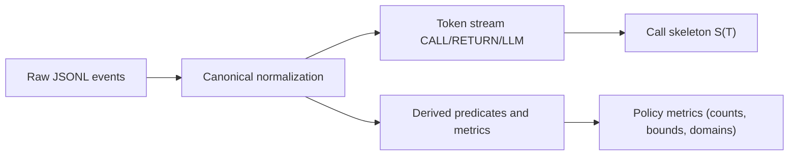
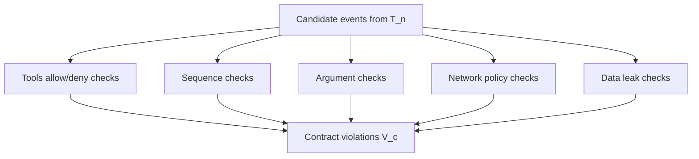
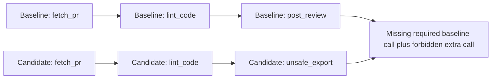
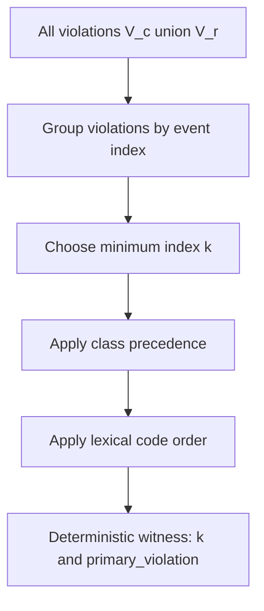
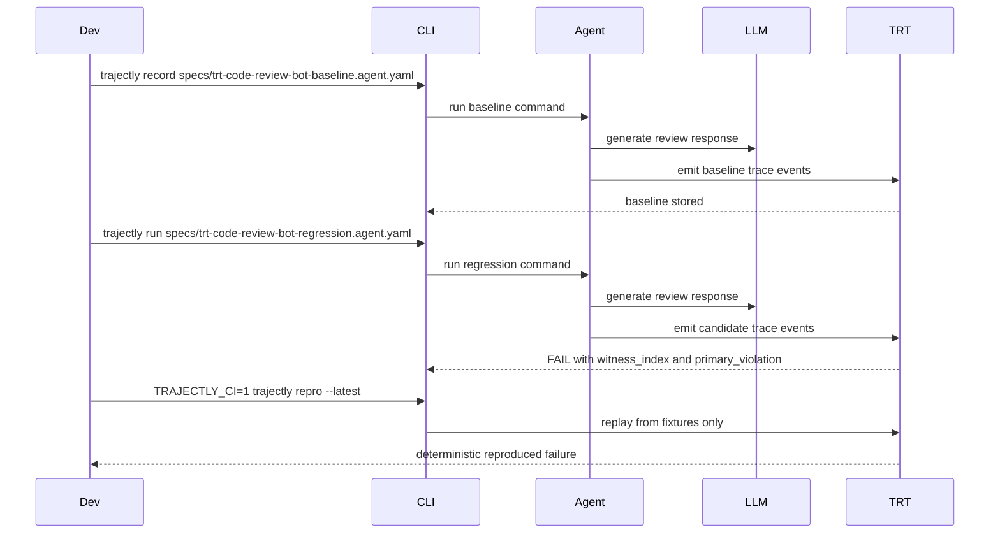

# TRT Theory: Practical and Formal

Trajectory Refinement Testing (TRT) is Trajectly's core verification model for agent CI. This page is intentionally
dual-purpose:

- **tutorial-first** for developers who need to ship quickly
- **formal enough** for teams that need deterministic, defensible guarantees

---

## 1) What TRT Proves

TRT compares a new run against a recorded baseline and evaluates explicit contracts. If behavior regresses, TRT returns
a deterministic witness index, violation details, and replay artifacts.

In plain language:

- baseline run behaves as intended
- new run is checked for safety and behavioral consistency
- failure is reported at the earliest violating event

TRT does not produce a heuristic score. It produces a deterministic decision tied to concrete events.

---

## 2) Core Objects and Notation

We reason about finite traces:

```text
T = <e0, e1, ..., en>
```

Where:

- `T_b`: baseline trace
- `T_n`: new trace
- `alpha`: deterministic abstraction from concrete events to semantic tokens/predicates
- `Phi`: contract monitor
- `S(T)`: tool-call skeleton extracted from `alpha(T)`

Key checks:

```text
V_c = Phi(T_n)
V_r = refine(S(T_b), S(T_n))
```

Verdict:

```text
PASS iff (V_c union V_r) is empty
FAIL otherwise
```

---

## 3) TRT Pipeline (High-Level Diagram)



TRT is deterministic by construction: same inputs, same verdict.

---

## 4) TRT Pipeline (Data and Artifacts)



---

## 5) Running Example Used in This Document (Example C)

This page uses **Code Review Bot** as the medium-complexity walkthrough.

Baseline spec (`PASS` intent):

```yaml
name: trt-code-review-bot
command: python -m examples.code_review_bot.main
contracts:
  tools:
    allow: [fetch_pr, lint_code, post_review]
    deny: [unsafe_export]
```

Regression spec (`FAIL` intent):

```yaml
name: trt-code-review-bot
command: python -m examples.code_review_bot.main_regression
contracts:
  tools:
    allow: [fetch_pr, lint_code, post_review]
    deny: [unsafe_export]
```

Behavioral difference:

- baseline calls `post_review`
- regression calls `unsafe_export`

This creates both a contract signal and a refinement signal.

---

## 6) Trace Model and Event Anatomy

TRT records JSONL events (one event per line). Typical event kinds:

- `run_started`
- `agent_step`
- `tool_called` / `tool_returned`
- `llm_called` / `llm_returned`
- `run_finished`

Trace anatomy for the **baseline** code-review run:



Simplified event sample:

```json
{
  "event_type": "tool_called",
  "seq": 6,
  "payload": {
    "tool_name": "post_review",
    "input": {
      "args": ["PR-2026", "Looks good overall. Replace magic number 1.2 with named constant."],
      "kwargs": {}
    }
  }
}
```

---

## 7) Abstraction `alpha`: From Events to Semantics

`alpha` is deterministic and pure. It converts concrete trace events into:

1. token stream
2. derived predicates
3. skeleton `S(T)` for refinement



Example (Code Review Bot baseline):

- tool-call skeleton: `[fetch_pr, lint_code, post_review]`
- derived counts: `tool_calls_total=3`
- denied-tool count: `unsafe_export=0`

Example (Code Review Bot regression):

- tool-call skeleton: `[fetch_pr, lint_code, unsafe_export]`
- denied-tool count: `unsafe_export=1`

---

## 8) Contracts `Phi`: Explicit Safety and Protocol Rules

Contracts are checked on `T_n` and produce violation set `V_c`.



In Example C regression, contract evaluation emits:

- `contract_tool_denied` at the `unsafe_export` call index

Because `unsafe_export` is explicitly denied in the spec.

---

## 9) Skeleton Refinement: Behavioral Consistency

Refinement checks whether required baseline tool behavior still exists in order.

```text
S(T_b) <= S(T_n)
```

For Example C:

- baseline: `[fetch_pr, lint_code, post_review]`
- regression: `[fetch_pr, lint_code, unsafe_export]`

`post_review` is missing, so refinement fails.



---

## 10) Decision Procedure (Formal)

Given `T_b`, `T_n`, and spec `sigma`:

```text
A_b = alpha(T_b)
A_n = alpha(T_n)
V_c = Phi(T_n, sigma)
V_r = refine(S(T_b), S(T_n), sigma)
V   = V_c union V_r
```

Then:

```text
if V is empty: PASS
else: FAIL with witness index k = min(v.event_index for v in V)
```

Primary violation is selected deterministically among violations at `k`.

---

## 11) Soundness and Determinism (Proof Sketches)

### Soundness (Checker-Relative)

Claim:

```text
PASS => (all configured contracts are satisfied on T_n) and (S(T_b) <= S(T_n))
```

Sketch:

1. `PASS` is returned only when `V` is empty.
2. `V` is the union of contract violations `V_c` and refinement violations `V_r`.
3. If `V` is empty, both `V_c` and `V_r` are empty.
4. Therefore all enabled checks in `Phi` pass, and refinement condition holds.

Limit:

- This is sound relative to configured checks, not a universal proof over all possible executions.

### Determinism

Claim: identical inputs produce identical outputs.

Sketch:

1. trace normalization and abstraction are deterministic functions
2. contract and refinement check order is fixed
3. witness is selected via deterministic ordering:
   - smallest event index
   - class precedence
   - lexical code order
4. therefore verdict, witness index, and primary violation are stable

---

## 12) Witness Resolution



Why this matters:

- two developers running the same artifacts get the same failure location
- CI and local debugging stay aligned

---

## 13) Counterexample and Repro Artifacts

On failure, Trajectly writes artifacts such as:

- `.trajectly/reports/latest.json`
- `.trajectly/reports/latest.md`
- `.trajectly/repros/<spec>.counterexample.prefix.jsonl`
- deterministic repro command output (`trajectly repro --latest`)

Optional minimization:

```bash
trajectly shrink --latest
```

This attempts to produce a smaller failing trace while preserving the failure class.

---

## 14) End-to-End Walkthrough: Code Review Bot in CI



Interpretation:

- regression introduces denied tool `unsafe_export`
- TRT fails at the earliest violating index
- report points directly to where the behavior changed
- repro command reproduces failure offline

---

## 15) Implementation Map (Core Modules)

- `src/trajectly/events.py` - event model and emission
- `src/trajectly/abstraction/pipeline.py` - deterministic abstraction `alpha`
- `src/trajectly/contracts.py` - contract evaluation
- `src/trajectly/refinement/skeleton.py` - skeleton extraction
- `src/trajectly/refinement/checker.py` - refinement checks
- `src/trajectly/trt/witness.py` - witness resolution
- `src/trajectly/trt/runner.py` - TRT orchestration and verdicts

---

## 16) Where to Go Next

- Start quickly: [`start_here.md`](start_here.md)
- Value in CI terms: [`how_trt_provides_value.md`](how_trt_provides_value.md)
- Formal guarantees: [`trt/guarantees.md`](trt/guarantees.md)
- Policy details: [`trt/contracts-reference.md`](trt/contracts-reference.md)
- Abstraction details: [`trt/abstraction-reference.md`](trt/abstraction-reference.md)
