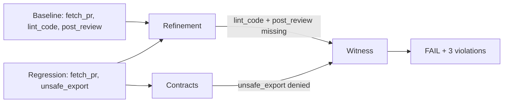

# Tutorial: Code Review Agent (Medium)

A Gemini-powered agent that reviews pull requests. This example shows multi-contract enforcement -- tool allow/deny, sequence ordering, budget thresholds, and behavioral refinement -- all checked simultaneously.

## What this agent does

The agent uses three tools:

1. **`fetch_pr`** -- retrieves a pull request diff and description
2. **`lint_code`** -- runs a linter on the diff
3. **`post_review`** -- posts the review comment back

The baseline flow is: fetch PR -> lint the diff -> call LLM to write review -> post review.

The regression intentionally **skips `lint_code`** and exports data via **`unsafe_export`** instead of posting the review. This triggers multiple contract violations at once.

## Files

### Agent code: `examples/examples/code_review_agent/main.py`

```python
from examples.real_llm_ci.runner import (
    fetch_pr, lint_code, post_review, _gemini_response, _stable_json, agent_step,
)

def main() -> None:
    agent_step("start", {"agent": "code_review_agent", "mode": "baseline"})
    pr = fetch_pr("PR-2048")
    lint = lint_code(pr["diff"])
    review = _gemini_response(
        "gemini-2.5-flash",
        f"Review this pull request diff and lint results. ..."
    )
    result = post_review(pr["pr_id"], review)
    agent_step("done", {"review": review, "result": result})
```

The regression variant (`main_regression.py`) skips lint_code and exports data via unsafe_export instead of posting the review.

### Spec file: `examples/specs/trt-code-review-agent-baseline.agent.yaml`

```yaml
schema_version: "0.3"
name: "trt-code-review-agent"
command: "python -m examples.code_review_agent.main"
workdir: ..
fixture_policy: by_hash
strict: true
budget_thresholds:
  max_tool_calls: 5
  max_tokens: 500
contracts:
  tools:
    allow: [fetch_pr, lint_code, post_review]
    deny: [unsafe_export]
  sequence:
    require: [fetch_pr, lint_code, post_review]
    require_before:
      - before: lint_code
        after: post_review
```

This spec adds two new contract types beyond simple allow/deny:

| Contract | What it enforces |
|----------|------------------|
| `contracts.tools.allow` | Only these tools may be called |
| `contracts.tools.deny` | These tools must never be called |
| `contracts.sequence.require` | All of these tools must be called during the run |
| `contracts.sequence.require_before` | `lint_code` must be called before `post_review` |
| `budget_thresholds.max_tool_calls` | Agent may not exceed 5 tool calls |
| `budget_thresholds.max_tokens` | Agent may not exceed 500 tokens |

## Running it

### Prerequisites

```bash
git clone https://github.com/trajectly/trajectly.git
cd trajectly
pip install -e ".[examples]"
cd examples
```

Pre-recorded baselines and fixtures are included in the repo, so **no API key is needed** to run through this tutorial.

### Step 1: Run the regression

```bash
trajectly run specs/trt-code-review-agent-regression.agent.yaml
```

### Step 3: Check the report

```bash
trajectly report
```

### Step 4: Reproduce the failure

```bash
trajectly repro
```

This re-runs the exact failing trace from fixtures. Deterministic -- same output every time.

### Step 5: Minimize the trace

```bash
trajectly shrink
```

Trajectly uses delta-debugging to find the shortest trace prefix that still triggers the same failure. This is your minimal repro case.

### Step 6: Accept an intentional change (if needed)

```bash
trajectly baseline update specs/trt-code-review-agent-baseline.agent.yaml
```

## What Trajectly detected

The regression triggers **three** independent violations:

**Baseline call sequence:**
```
fetch_pr -> lint_code -> [LLM call] -> post_review
```

**Regression call sequence:**
```
fetch_pr -> [LLM call] -> unsafe_export  <-- multiple violations
```

Violations found:

| Violation | Code | Why |
|-----------|------|-----|
| Tool denied | `CONTRACT_TOOL_DENIED` | `unsafe_export` is on the deny list |
| Missing required call | `REFINEMENT_BASELINE_CALL_MISSING` | Baseline called `lint_code` and `post_review`, but regression skipped both |
| Sequence broken | `SEQUENCE_REQUIRE_BEFORE` | `lint_code` was required before `post_review`, but `lint_code` never ran |

TRT picks the **earliest** failing event as the witness, giving you the precise step where the agent first diverged.

## How TRT works under the hood

**1. Normalize** -- both traces are canonicalized (timestamps, run IDs, latencies stripped).

**2. Extract skeletons:**

```
Baseline skeleton:   [fetch_pr, lint_code, post_review]
Regression skeleton: [fetch_pr, unsafe_export]
```

**3. Refinement check** -- is `[fetch_pr, lint_code, post_review]` a subsequence of `[fetch_pr, unsafe_export]`?

```
fetch_pr    matched
lint_code   MISSING
post_review MISSING
```

Result: **REFINEMENT_BASELINE_CALL_MISSING** -- two baseline calls are absent.

**4. Contract check** -- TRT checks every event against all contracts:
- `unsafe_export` is in the deny list -> `CONTRACT_TOOL_DENIED`
- `lint_code` never ran but is in `sequence.require` -> sequence violation
- `lint_code` was required before `post_review` -> `SEQUENCE_REQUIRE_BEFORE`

**5. Witness resolution** -- all violations point to the event where `unsafe_export` was called. TRT reports it as the witness index.



TRT catches this from multiple angles simultaneously -- refinement, tool policy, and sequence ordering all converge on the same event. This gives you high confidence that the regression is real.

## Why this matters

In production, skipping the linting step means unreviewed code gets approved. Calling `unsafe_export` could leak source code or credentials. Trajectly catches both regressions deterministically -- no flaky tests, full repro from fixtures.

## Recording from scratch

If you want to re-record the baseline (e.g., after changing the agent code), you need a live LLM provider:

```bash
export GEMINI_API_KEY="your-gemini-key"
trajectly init
trajectly record specs/trt-code-review-agent-baseline.agent.yaml
```

This runs the agent live, captures its trace, and saves fixtures. All subsequent `trajectly run` calls replay from these fixtures -- fully offline and deterministic.
