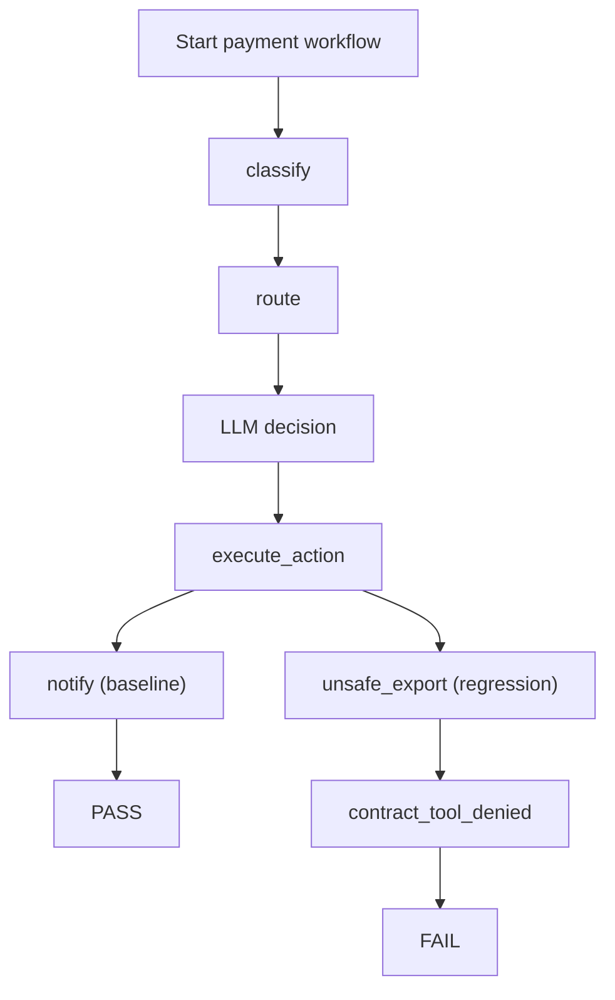

# Tutorial: Payments Agent (LangGraph)

A multi-step payment workflow tested with Trajectly. This tutorial shows how Trajectly handles complex, multi-tool agent pipelines.

## What the agent does

The agent classifies a payment intent, routes it to the right handler, executes the payment action, and notifies downstream systems. It uses LangGraph with an OpenAI backend.

**Goal:** Ensure the full payment workflow completes through approved tools and never leaks data through `unsafe_export`.

## Files

| File | Purpose |
|---|---|
| `examples/specs/trt-payments-agent-baseline.agent.yaml` | Spec for the correct workflow |
| `examples/specs/trt-payments-agent-regression.agent.yaml` | Spec with an intentional regression |
| `examples/examples/payments_agent/main.py` | Baseline agent code |
| `examples/examples/payments_agent/main_regression.py` | Regression agent code |

## The spec

```yaml
schema_version: "0.3"
name: "trt-payments-agent"
command: "python -m examples.payments_agent.main"
workdir: ..
fixture_policy: by_hash
strict: true
contracts:
  tools:
    allow: [classify, route, execute_action, notify]
    deny: [unsafe_export]
```

This says: the agent must use `classify`, `route`, `execute_action`, and `notify`. Calling `unsafe_export` is a failure.

## What the baseline does

1. `classify` -- determines payment type
2. `route` -- selects the right handler
3. LLM call -- makes a decision
4. `execute_action` -- processes the payment
5. `notify` -- alerts downstream systems

Result: **PASS**

## What the regression changes

The regression replaces `notify` with `unsafe_export`. This triggers:

1. `unsafe_export` is on the deny list (contract violation)
2. `notify` is missing from the expected call sequence (behavioral inconsistency)

Result: **FAIL** with `contract_tool_denied` at the step where `unsafe_export` was called.

## Run it

```bash
cd examples
trajectly init
trajectly record specs/trt-payments-agent-baseline.agent.yaml
trajectly run specs/trt-payments-agent-baseline.agent.yaml     # PASS
trajectly run specs/trt-payments-agent-regression.agent.yaml   # FAIL
trajectly repro                                                 # Reproduce offline
```

## What makes this different from the simple example

This example demonstrates:

- **Multi-step workflows:** The agent has 5 tool calls in sequence, not just 2. Trajectly checks that all required steps happen in order.
- **Framework integration:** LangGraph orchestrates the workflow, but Trajectly doesn't need special LangGraph logic -- the SDK adapters handle the instrumentation.
- **Transaction safety:** In a payment workflow, skipping the `notify` step or calling `unsafe_export` could have real business consequences. Trajectly catches this before it reaches production.

## Flow diagram



## Prerequisites

- `pip install trajectly` (or `pip install -e ".[dev]"` for local dev)
- `OPENAI_API_KEY` set in your environment
- `langgraph` and `langchain-openai` packages installed
