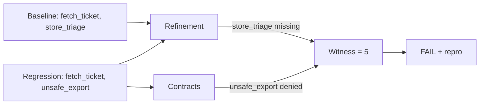

# Tutorial: Ticket Classifier (Simple)

A simple OpenAI-powered agent that classifies support tickets. This tutorial walks through every file and command.

## What this agent does

The agent uses two tools:

1. **`fetch_ticket`** -- retrieves a support ticket by ID
2. **`store_triage`** -- stores the classification result

The baseline flow is: fetch ticket -> call LLM to classify -> store result.

The regression intentionally calls **`unsafe_export`** instead of `store_triage`, which violates the tool contract.

## Files

### Agent code: `examples/examples/support_triage/main.py`

```python
from examples.real_llm_ci.runner import run_example

def main() -> None:
    run_example(
        scenario="ticket_classifier",
        provider="openai",
        mode="baseline",
        model="gpt-4o-mini",
    )
```

This is a thin entrypoint that calls the shared runner with the `ticket_classifier` scenario in `baseline` mode.

The regression variant (`main_regression.py`) is identical except `mode="regression"`, which causes the agent to call `unsafe_export` instead of `store_triage`.

### Spec file: `examples/specs/trt-support-triage-baseline.agent.yaml`

```yaml
schema_version: "0.3"
name: "trt-support-triage"
command: "python -m examples.support_triage.main"
workdir: ..
fixture_policy: by_hash
strict: true
contracts:
  tools:
    allow: [fetch_ticket, store_triage]
    deny: [unsafe_export]
```

Field by field:

| Field | Meaning |
|-------|---------|
| `schema_version` | Spec format version (always `"0.3"`) |
| `name` | Unique spec identifier |
| `command` | Shell command to run the agent |
| `workdir` | Working directory (relative to the spec file) |
| `fixture_policy` | How to match LLM responses during replay (`by_hash` = deterministic matching) |
| `strict` | Fail on any unmatched fixture |
| `contracts.tools.allow` | Only these tools may be called |
| `contracts.tools.deny` | These tools must never be called |

The regression spec is the same except the command points to `main_regression` instead of `main`.

## Running it

### Prerequisites

```bash
git clone https://github.com/trajectly/trajectly.git
cd trajectly
pip install -e ".[examples]"
export OPENAI_API_KEY="sk-..."
```

### Step 1: Record the baseline

```bash
cd examples
trajectly init
trajectly record specs/trt-support-triage-baseline.agent.yaml
```

This runs the agent, captures its trace, and saves fixtures to `.trajectly/baselines/` and `.trajectly/fixtures/`.

### Step 2: Run the regression

```bash
trajectly run specs/trt-support-triage-regression.agent.yaml
```

Trajectly replays the recorded LLM responses and compares the new trace against the baseline.

### Step 3: Check the report

```bash
trajectly report
```

Expected output:

```
### Trajectly Regression Report

- Specs processed: **1**
- Regressions: **1**

| Spec | Status | Repro |
|---|---|---|
| trt-support-triage | regression | trajectly repro --latest |
```

### Step 4: Reproduce the failure

```bash
trajectly repro --latest
```

This re-runs the exact failing trace deterministically.

## What Trajectly detected

The regression calls `unsafe_export`, which is in the `deny` list. Trajectly reports:

- **Failure step**: the event index where `unsafe_export` was called
- **Violation code**: `CONTRACT_TOOL_DENIED`
- **Message**: `unsafe_export denied by policy`
- **Repro command**: `trajectly repro --latest`

The baseline called `fetch_ticket` then `store_triage` (both in the `allow` list), so it passes.

## How TRT works under the hood

Here's what the TRT algorithm does when you run the regression:

**1. Normalize** -- both the baseline trace and the regression trace are stripped of timestamps, run IDs, and other non-deterministic fields, producing canonical traces.

**2. Extract skeletons** -- TRT pulls out the ordered tool-call names from each trace:

```
Baseline skeleton:   [fetch_ticket, store_triage]
Regression skeleton: [fetch_ticket, unsafe_export]
```

**3. Refinement check** -- TRT asks: is `[fetch_ticket, store_triage]` a subsequence of `[fetch_ticket, unsafe_export]`?

```
fetch_ticket ✓  (found at position 0)
store_triage ✗  (not found -- unsafe_export is there instead)
```

Result: **REFINEMENT_BASELINE_CALL_MISSING** -- `store_triage` is missing from the current run.

**4. Contract check** -- TRT checks every event against the spec's contracts. It finds `unsafe_export` in the `deny` list:

Result: **CONTRACT_TOOL_DENIED** -- `unsafe_export` is explicitly blocked.

**5. Witness resolution** -- both violations point to the same event (the `tool_called:unsafe_export` event at index 5 in the full trace). TRT picks the earliest violation index as the witness.

**6. Verdict** -- `FAIL` at witness index 5, with two violations and a deterministic repro command.



This is the power of TRT: two independent checks (refinement + contracts) converge on the same witness, giving you high confidence in the diagnosis.
