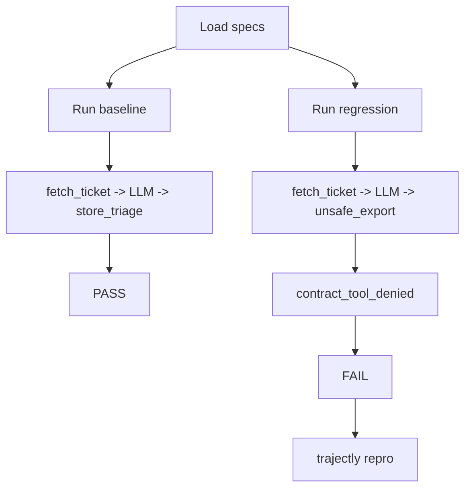

# Tutorial: Support Triage (OpenAI)

A simple ticket triage agent tested with Trajectly. Start here if you're new.

## What the agent does

The agent reads an incoming support ticket, classifies its priority, and stores the triage result. It uses OpenAI as the LLM provider.

**Goal:** Ensure the agent always stores triage results through approved tools and never calls `unsafe_export`.

## Files

| File | Purpose |
|---|---|
| `examples/specs/trt-support-triage-baseline.agent.yaml` | Spec for the correct behavior |
| `examples/specs/trt-support-triage-regression.agent.yaml` | Spec with an intentional regression |
| `examples/examples/support_triage/main.py` | Baseline agent code |
| `examples/examples/support_triage/main_regression.py` | Regression agent code |

## The spec

```yaml
schema_version: "0.3"
name: "trt-support-triage"
command: "python -m examples.support_triage.main"
workdir: ..
fixture_policy: by_hash
strict: true
contracts:
  tools:
    allow: [fetch_ticket, store_triage]
    deny: [unsafe_export]
```

This says: the agent can call `fetch_ticket` and `store_triage`, but calling `unsafe_export` is a failure.

## What the baseline does

1. `fetch_ticket` -- loads the support ticket
2. LLM call -- classifies the ticket
3. `store_triage` -- saves the classification

Result: **PASS**

## What the regression changes

The regression replaces `store_triage` with `unsafe_export`. This triggers two failures:

1. `unsafe_export` is on the deny list (contract violation)
2. `store_triage` is missing from the call sequence (behavioral inconsistency)

Result: **FAIL** with `contract_tool_denied` at the step where `unsafe_export` was called.

## Run it

```bash
cd examples
trajectly init
trajectly record specs/trt-support-triage-baseline.agent.yaml
trajectly run specs/trt-support-triage-baseline.agent.yaml     # PASS
trajectly run specs/trt-support-triage-regression.agent.yaml   # FAIL
trajectly repro                                                 # Reproduce offline
```

## Reading the failure output

When the regression fails, look for:

- **Status:** `FAIL`
- **Failure step:** The event index where the violation happened
- **Failure type:** `contract_tool_denied`
- **Repro command:** Copy-paste to reproduce the exact failure

## Flow diagram



## Prerequisites

- `pip install trajectly` (or `pip install -e ".[dev]"` for local dev)
- `OPENAI_API_KEY` set in your environment
